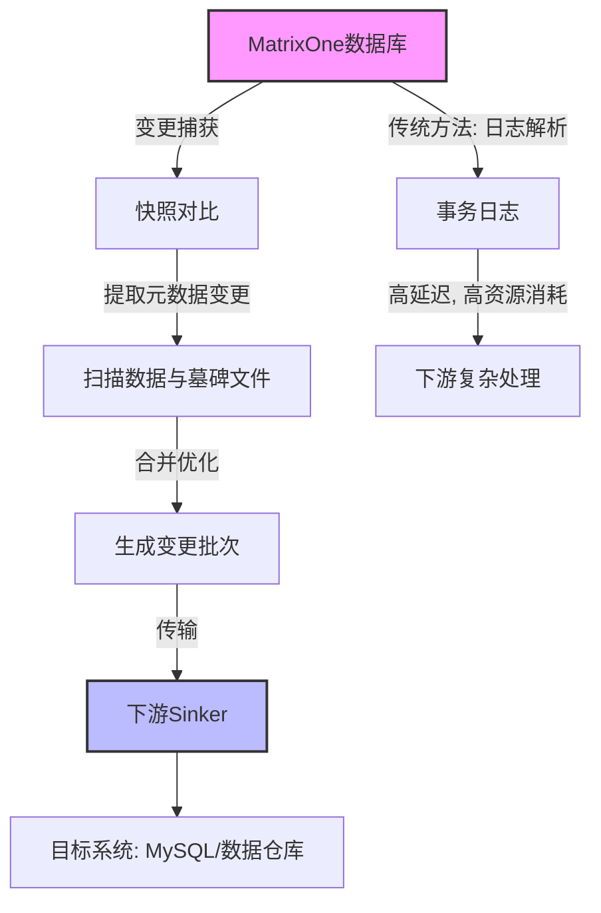
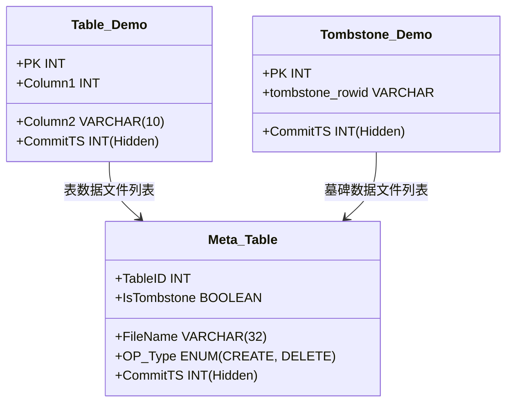
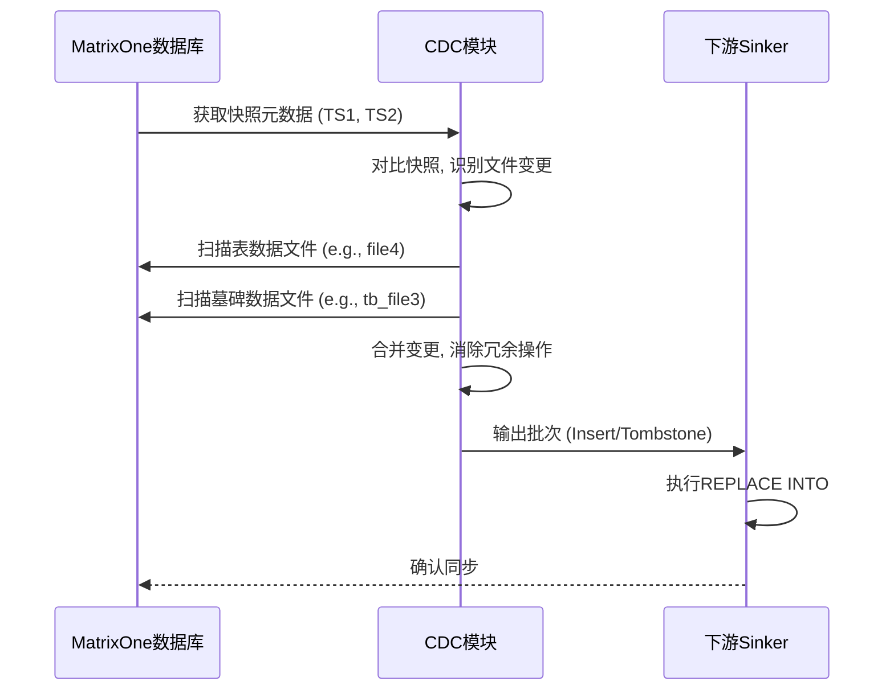
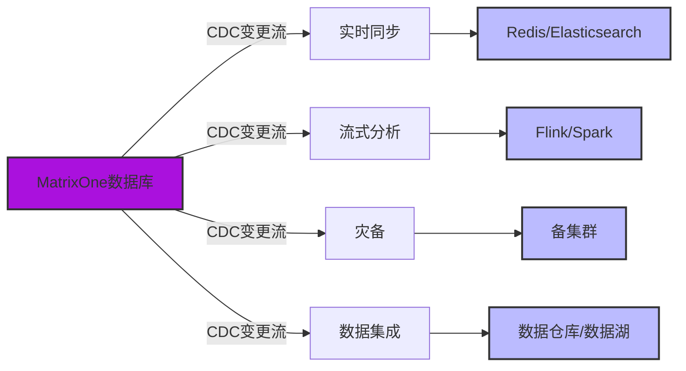

# MatrixOne 高效 CDC：基于快照的分布式数据库优化方案

在现代数据库领域，跨系统的数据同步对实时分析、灾备和数据集成至关重要。变更数据捕获（CDC，Change Data Capture）技术通过追踪数据库中的增删改操作，将这些变更传递给其他系统，是实现这一目标的关键。传统 `CDC` 方法依赖事务日志解析，在混合事务分析处理（HTAP）场景下面临性能瓶颈，尤其是在处理海量数据时效率低下。作为一款面向 `HTAP` 的分布式数据库， `MatrixOne` 引入了基于快照的 `CDC` 方法，作为传统日志解析方式的补充，显著提升了数据变更捕获的效率。本文将探讨 `MatrixOne` 的 `CDC` 的核心优势、技术原理及实际应用场景。

## CDC简介：为何重要？

`CDC` ，即变更数据捕获，是一种用于监控数据库变更（插入、更新、删除及模式变更）并将这些变更以可消费格式传递给其他系统的技术。它是连接数据库与下游应用（如缓存、数据仓库或搜索引擎）的桥梁，广泛应用于实时同步、分析和灾备等场景。

传统 `CDC` 依赖于解析数据库事务日志（如 `MySQL` 的 `binlog` 或 `PostgreSQL` 的 `WAL` ）。尽管这种方式在事务型场景下表现尚可，但在 `HTAP` 等复杂环境中却暴露出诸多问题：
- **解析延迟**：大日志文件的解析耗时较长，导致变更捕获延迟。
- **资源开销**：日志解析需要大量CPU和内存，影响数据库性能。
- **HTAP适配性差**：在海量数据场景下，日志可能只记录元数据变更，推导真实数据变更复杂且低效。
- **历史操作冗余**：下游系统需要处理大量历史数据，增加复杂度和存储成本。
- **长期追溯困境**：长周期变更（如跨月或跨年）需要保留所有历史状态，导致存储和处理成本激增。

这些问题在分布式 `HTAP` 数据库（如 `MatrixOne` ）中尤为突出，因为它们需要同时处理高并发事务和大规模分析任务。`MatrixOne` 的 `CDC` 模块通过基于快照的补充方法，有效应对这些挑战，提升了捕获效率。

## MatrixOne的快照式CDC：技术创新

**MatrixOne** 基于其列存架构和分布式设计，摒弃了传统日志依赖的 `CDC` 范式，转而利用快照直接从数据库内核捕获变更数据。这种方法特别适合 `HTAP` 场景，能够高效处理批量数据变更和元数据操作。

### 工作原理（简要概述）

MatrixOne将表数据和“墓碑数据”（标记删除操作）分开存储，并通过元数据表管理文件列表。这个元数据表本质上是一个普通表，记录了文件的创建和删除操作，可通过 `SQL` 查询，并借助数据库的事务引擎保证一致性。

捕获两个时间点（如TS1到TS2）之间的变更时，流程如下：
1. **快照对比**：比较 `TS1` 和 `TS2` 的元数据快照，识别新增或删除的文件。
2. **数据扫描**：仅扫描相关文件，提取插入（新数据）和墓碑（删除）操作，按时间范围过滤。
3. **合并优化**：合并变更，消除冗余历史操作。例如，若某行被多次插入和删除，最终输出可能仅为净效果（如单次插入），减少下游数据量。

这种方式大幅降低延迟和资源消耗。更新操作被拆分为删除和插入操作对，输出结果以批次形式发送到下游，支持如 `MySQL` 的 `REPLACE INTO` 语法，确保最终一致性。

核心优势：
- **无日志解析开销**：直接访问内核数据，减少延迟和资源占用。
- **HTAP优化**：轻松处理批量变更，降低复杂度和延迟。
- **减轻下游负担**：通过合并历史操作，减少下游处理的数据量，简化ETL流程。
- **高效快照**：无需存储所有历史状态，显著降低长期变更追溯的存储和处理成本。

`MatrixOne` 的 `CDC` 支持单表事务原子性、更新顺序一致性以及 `DDL` 事件捕获（如 `CREATE TABLE` ）。通过 `mo-backup` 工具，用户可轻松管理 `CDC` 流程，并设置点时间恢复（PITR）时长以防止文件被垃圾回收。

**图1：MatrixOne CDC整体流程**，展示快照式捕获与传统方法的对比。

**图2：表数据与墓碑数据结构**，展示 `MatrixOne` 中数据存储的逻辑视图。

**图3：快照式变更捕获流程**，详细描述捕获变更的步骤。

## 实际应用场景：释放CDC的潜力

`MatrixOne` 的 `CDC` 不仅在技术上令人瞩目，还在实际场景中展现了强大价值。以下是一些典型应用：

1. **实时数据同步**：在电商平台中， `MatrixOne` 的库存变更可通过 `CDC` 实时同步到 `Redis` 缓存或 `Elasticsearch` 索引，确保搜索和推荐系统的数据新鲜度。这对于高流量应用至关重要，避免因数据滞后导致的销售损失。

2. **流式分析管道**：将 `CDC` 事件推送到 `Apache Flink` 或 `Spark` ，进行实时欺诈检测或用户行为分析。在 `HTAP` 场景下， `MatrixOne` 能在不干扰事务的情况下处理海量数据，适合金融科技或物联网等需要即时决策的场景。

3. **灾备与备份**： `CDC` 支持向备集群复制数据，确保最终一致性。对于金融或医疗等需合规的行业，这提供了可靠的审计跟踪，且无需全量备份的资源开销。

4. **异构数据集成**：将 `MatrixOne` 数据同步到数据仓库（如 `Snowflake` ）或数据湖（如 `S3` ），支持非结构化索引或全文搜索等场景。 `CDC` 的灵活性使其适合一致性要求较低但构建成本高的任务。

5. **定制化ETL流程**：用户可订阅特定表或过滤事件，甚至通过订阅 `mo_catalog.mo_tables` 捕获模式变更。这种灵活性适合动态变化的数据架构。

**图4：CDC应用场景**，展示 `CDC` 在不同用例中的数据流向。

## 总结：分布式数据库CDC的未来

`MatrixOne` 的快照式 `CDC` 作为传统日志解析的有力补充，为分布式 `HTAP` 环境提供了高效、低开销的数据变更捕获方案。它通过解决延迟和资源占用问题，为开发者构建更灵活、可扩展的数据生态提供了可能。如果你的项目涉及 `HTAP` 负载或需要高效数据同步，不妨试试 `MatrixOne` 。访问官方文档或 `mo-backup` 工具开始体验，让数据同步变得更智能！
