# Git for Data: 像 Git 一样管理你的数据

当你的 **AI Agent** 突然清空核心数据库，或是悄悄注入虚假数据时，传统的数据恢复手段往往耗时费力。而 **Git for Data** 带来的变革，能让这一切像回滚代码提交一样简单。

```sql
DATA-CTL REVERT DATABASE `agent1_db` TO TIMESTAMP 2025-08-01 12:00:00.123456;
```
瞬间数据回滚到指定时间点。这就是 **Git for Data** 的魔力 -- 版本控制, 快速回滚, 分支, 合并, 追踪变更, **AI** 时代的数据管理新范式。
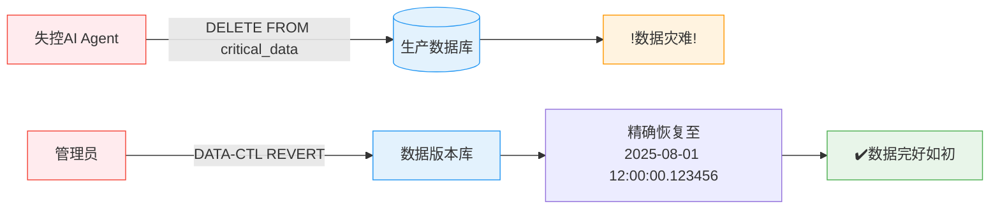

## 为什么 AI 需要 Git for Data

### 对抗幻觉

1. 幻觉预防：通过数据版本控制，提升数据质量，减少幻觉发生。
2. 幻觉后果修复：幻觉很难避免，通过数据版本控制，可以快速回滚到指定版本，修复幻觉后果。之后也可以通过错误版本进行溯源分析，避免类似错误再次发生。

### 数据溯源

1. 版本控制： 通过版本控制系统，可以清晰地追溯到每个版本的变更，支持跨时间、跨团队的协作，确保数据、模型和代码的更新历史可追溯。
2. 数据一致性：每个阶段的数据都可以被标记为特定版本，使得不同阶段的数据可以无缝对接，避免数据漂移，并确保结果的可复现性。
3. 溯源效率：当出问题时，能够像代码回溯一样迅速定位到数据问题，提升错误修复的效率。
4. 研究和开发效率： 变更历史能够帮助理解每个步骤的影响，提升研究和开发效率。

### 数据共享

1. 团队协作： 通过版本控制，可以方便地进行团队协作，比如多人协作开发一个模型，或者多人协作开发一个数据集。
2. 提升数据质量： 通过数据版本迭代，可以方便地进行数据质量的提升，比如数据清洗、数据增强、数据增强等。有过代码迭代经验的人都知道，代码迭代对于提升代码质量有多重要。

### 数据安全

1. 分支隔离： 通过分支隔离，可以方便地进行数据隔离。
2. 权限控制： 通过版本控制，可以方便地进行权限控制，比如只允许特定用户访问特定版本的数据。
3. 审计： 变更可回溯，可审计。

### 测试与发布

1. **线上调试:** 追溯到问题数据版本，切出调试数据分支，在完全隔离的沙箱环境中进行调试。
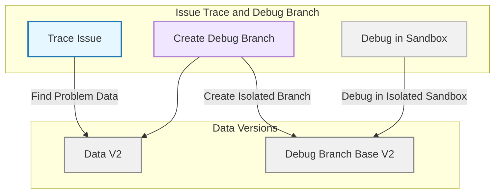
2. **CI 测试:** 轻松创建和管理多个测试环境，每个环境都有自己的数据版本。也支持多版本并行测试。
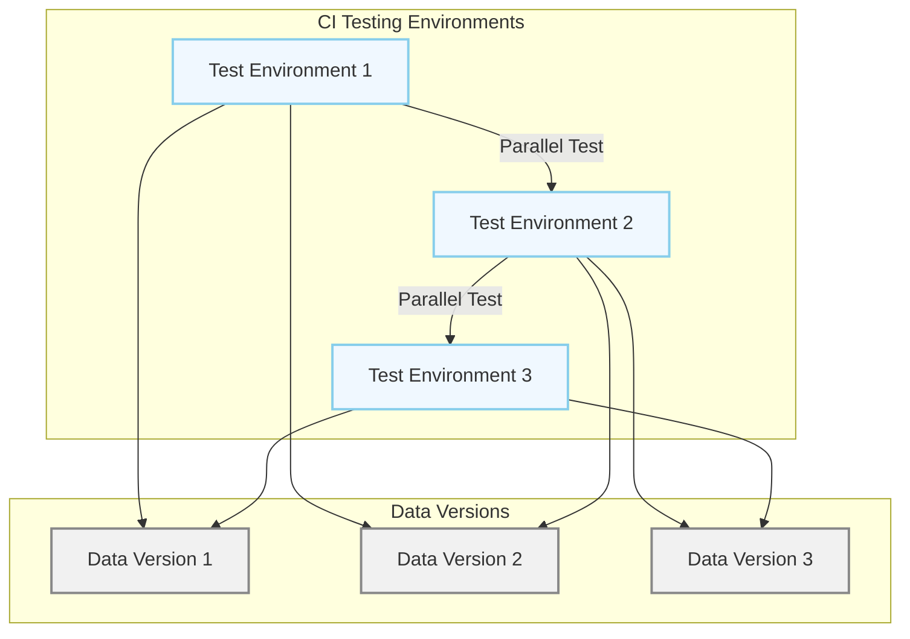
3. **业务发布与回滚:** 可以实现数据版本与代码版本同步发布。遇到问题时，可以快速回滚到指定版本。
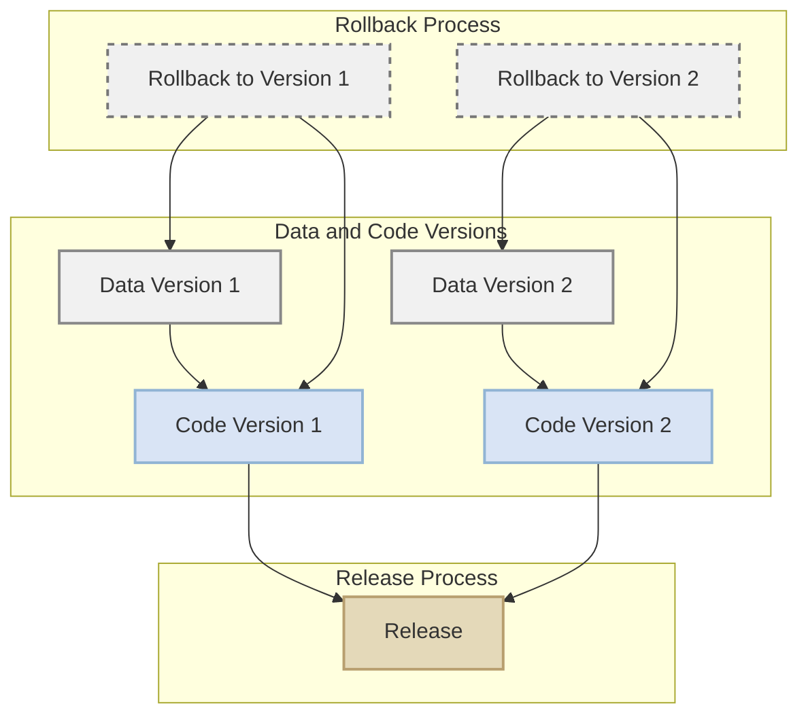

## 怎样支撑 Git for Data 能力

### 版本控制

1. **粒度控制:** `TABLE|DATABASE|TENANT|CLUSTER` 级别的回滚成本差异巨大。更细粒度的回滚成本更低，影响范围更小。比如 `Agent` 只对某张表有写权限，那么只需要回滚该表。
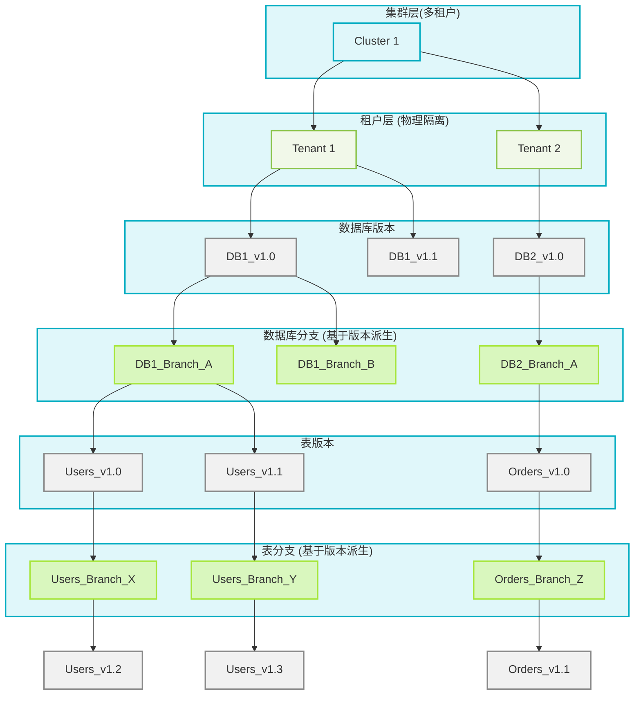
2. **恢复窗口(Recovery Window):** 幻觉的不可预测性，恢复窗口很难确定。一般而言，恢复窗口越长，恢复时间越长或成本越高。想要修复幻觉后果，需要支持很长的恢复窗口，同时要支持秒级恢复。在保障这两个需求的前提下，控制成本。
3. **数据快照(Snapshot):** 支持创建数据快照，可以方便地进行数据版本管理。
```sql
CREATE SNAPSHOT db1_ss_v1 FOR DATABASE db1;
CREATE SNAPSHOT db1_t1_ss_v1 FOR TABLE db1 t1;
```

4. **版本比较(Diff):** 支持版本之间相互比较，能够快速定位到差异，帮助理解每个步骤的影响。也是实现数据溯源的基础。
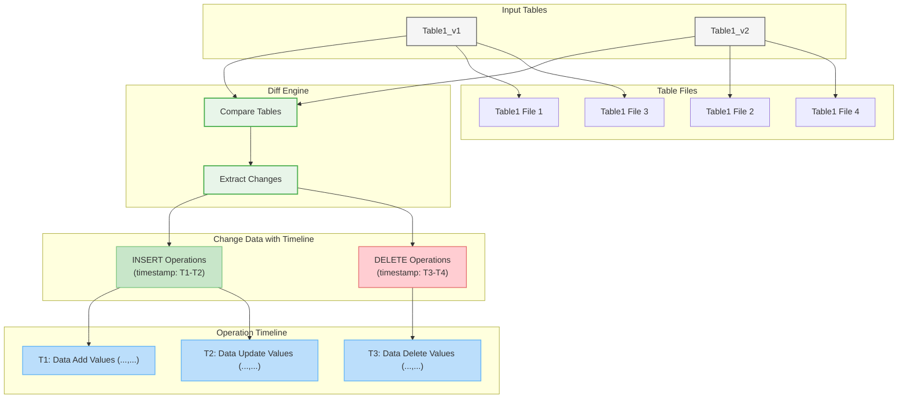
4. **数据克隆(Clone):** 支持数据克隆，可以方便地进行数据克隆。克隆的成本要低，延迟极小。

```sql
CREATE TABLE `db1.table2` CLONE FROM `db1.table1`;
```
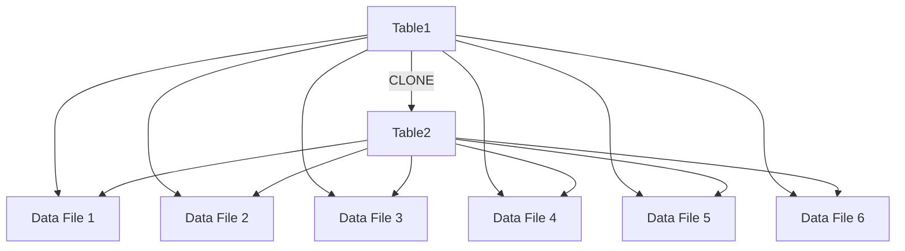
5. **数据分支(Branch):** 支持数据分支，可以方便地进行数据隔离。创建删除分支的成本要低，延迟极小。
```sql
CREATE TABLE `db1.table2` BRANCH `branch1` FROM TABLE `db1.table1` {SNAPSHOT = 'V2'};
INSERT INTO `db1.table2` (col1, col2) VALUES (1, 'a');
....
```
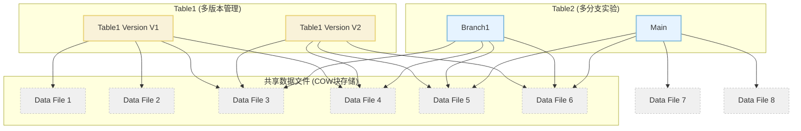
6. **数据回滚(Reset):** 支持数据回滚，方便快速地进行数据回滚。
```sql
RESTORE DATABASE `db1` FROM SNAPSHOT `db1_ss_v1`;
DATA-CTL REVERT DATABASE `db1` TO TIMESTAMP 2025-08-01 12:00:00.123456;
DATA-CTL REVERT TABLE `db1.table1` TO TIMESTAMP 2025-08-01 12:00:00.123456;
DATA-CTL REVERT BRANCH `db1_dev` TO TIMESTAMP 2025-08-01 12:00:00.123456;
```
7. **分支 Rebase:** 支持分支 Rebase，方便快速合并分支。基于 `Diff` 能力。
8. **数据合并(Merge):** 支持数据合并，方便快速合并数据。基于 `Diff` 能力。

### 权限控制

1. **细粒度权限控制:** 支持细粒度权限控制，比如某 `Agent` 用户只能基于某个 `TABLE` 或 `DATABASE` 的某个版本进行操作。
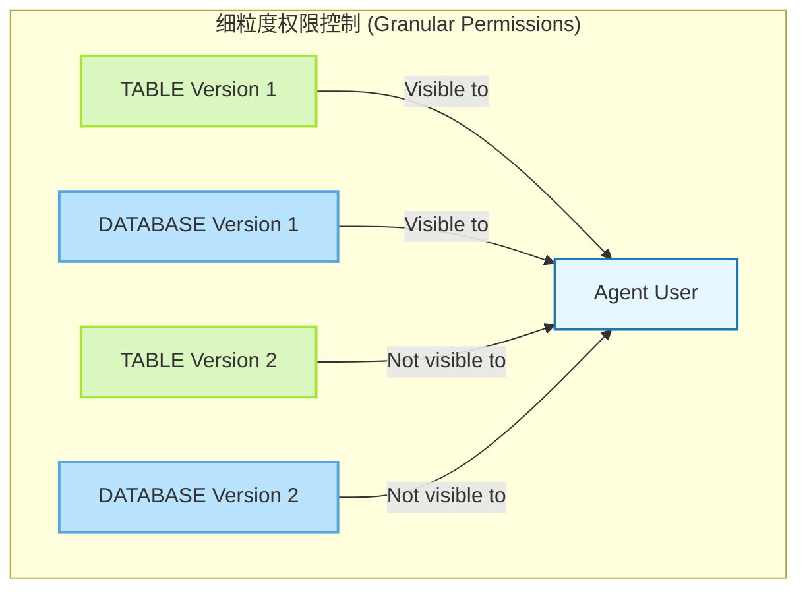
2. **跨租户权限控制:** 支持跨租户权限控制，比如 `acc1` 租户可以将自己 `db1.table1` 的 `v1` 版本共享给 `acc2` 租户。`acc2` 租户可以基于 `acc1` 租户共享的 `db1.table1` 的 `v1` 版本创建新的分支或克隆数据。
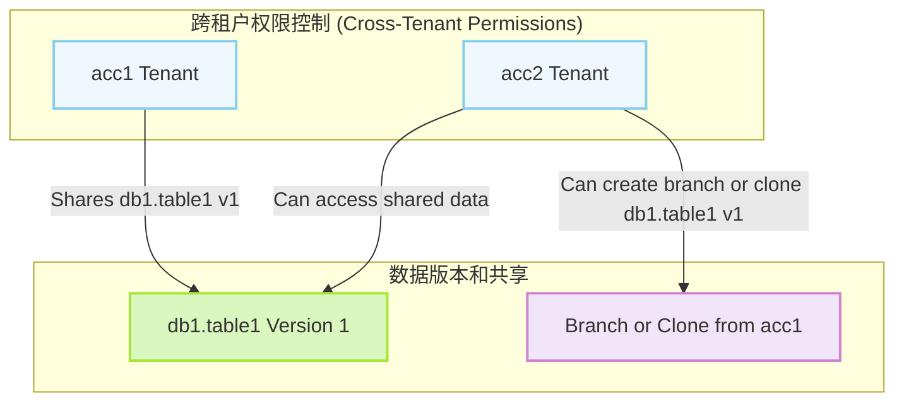

### 存储优化

1. **CLONE:** 并非数据冗余复制，而是数据共享。成本低，延迟极小。

```sql
-- 表 `db1.table1` 数据量100GB
CREATE TABLE `db1.table2` CLONE FROM `db1.table1`;
-- CLONE 延迟极小，因为数据共享，不需要复制数据。
-- 表 `db1.table2` 数据量100GB，但实际存储量只有10GB，因为共享了 `db1.table1` 的10GB数据。
```

2. **数据分支存储**：子分支共享主版本数据并存储差异数据。依赖 `CLONE` 能力。

```sql
-- 表 `db1.table1` 数据量100GB
CREATE TABLE `db1.table2` BRANCH `branch1` FROM TABLE `db1.table1` {SNAPSHOT = 'V2'};
-- 表 `db1.table2` 数据量100GB，但实际存储量只有10GB，因为共享了 `db1.table1` 的10GB数据。
-- BRANCH 底层依赖 `CLONE` 能力。对比 `CLONE`，多了 `BRANCH` 的操作管理，为分支管理提供支持。
```

3. **恢复窗口优化**：
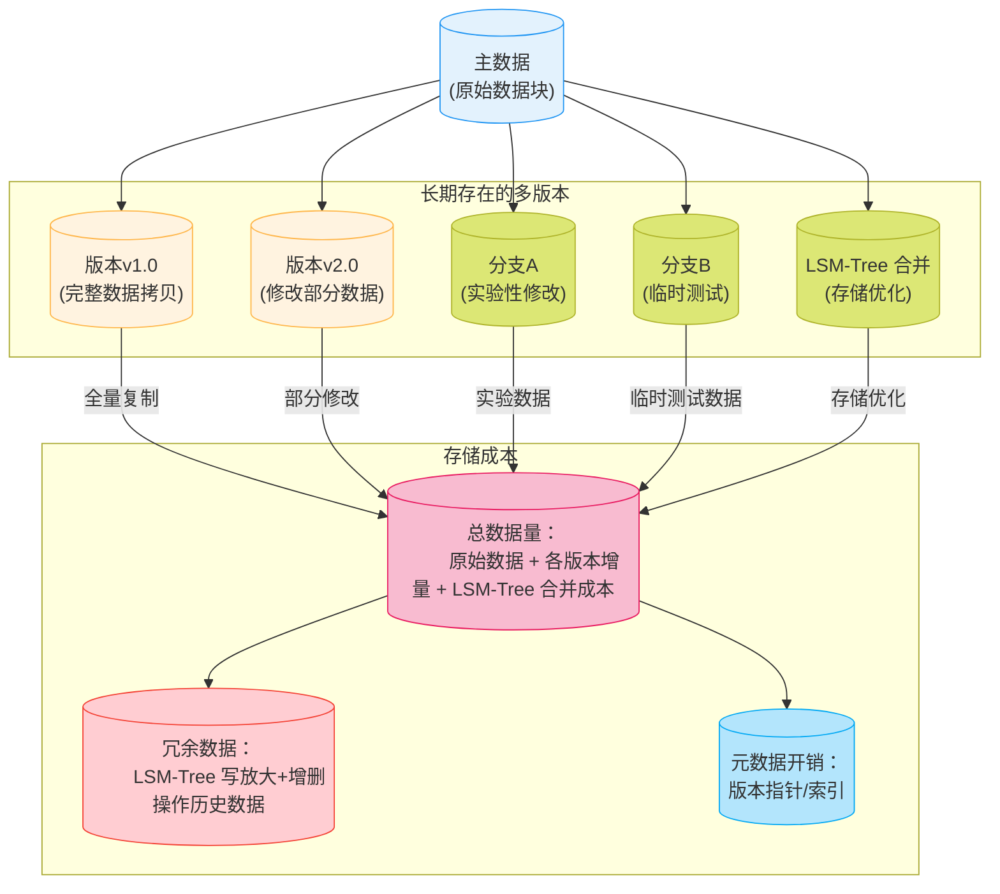
> 对于 `LSM-Tree` 的存储引擎，支持较长恢复窗口的快速恢复，是比较大的挑战。

## 结语

**Git for Data** 代表了一种数据管理的革命性范式，它有机融合了声明式数据管理和数据即代码的先进理念，同时引入了类似 **Git** 的强大版本控制能力。这种创新架构从根本上改变了数据管理的方式，使其变得更加灵活、可控且高效。

这一技术范式为解决现代AI系统中的复杂数据挑战提供了全新思路。它不仅能够有效保障数据质量和安全性，还能显著提升数据一致性和开发效率。通过 **Git for Data**，数据管理实现了质的飞跃——从静态存储转变为动态治理，使数据能够像代码一样实现精确的版本追溯、高效协作、即时回滚和可靠恢复。

展望未来，采用 **Git for Data** 将带来多重价值：它不仅优化了数据管理流程，更为重要的是，它为AI和大数据领域的研究与应用奠定了更高效、更精确的基础。这种转变使得数据管理不再是制约创新的技术瓶颈，而是成为推动技术进步的关键赋能者，为各行业的数字化转型提供坚实支撑。
