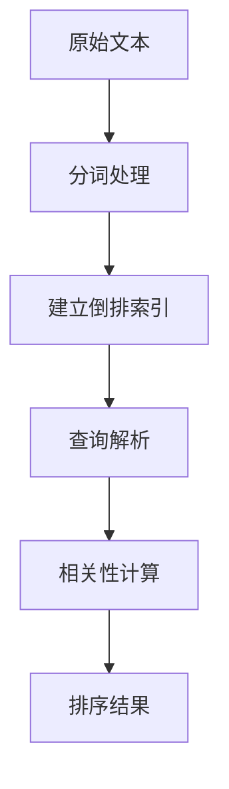

# MatrixOne 全文检索用户指南

## 目录

- [快速开始](#快速开始)
- [基础概念](#基础概念)
  - [全文检索概述](#全文检索概述)
  - [支持的算法和解析器](#支持的算法和解析器)
- [使用指南](#使用指南)
  - [创建全文索引](#创建全文索引)
  - [全文检索查询](#全文检索查询)
  - [混合过滤检索](#混合过滤检索)
- [性能优化](#性能优化)
  - [索引创建优化](#索引创建优化)
  - [查询性能优化](#查询性能优化)
- [问题排查](#问题排查)
  - [常见问题与解决方案](#常见问题与解决方案)
- [最佳实践](#最佳实践)
- [SDK 使用](#sdk-使用)
- [未来规划](#未来规划)

---

## 快速开始

### 创建表和索引

```sql
-- 创建包含文本列的表
CREATE TABLE articles (
  id INT PRIMARY KEY,
  title VARCHAR(200),
  content TEXT,
  author VARCHAR(100),
  category VARCHAR(50),
  created_at TIMESTAMP DEFAULT CURRENT_TIMESTAMP
);

-- 创建全文索引
CREATE FULLTEXT INDEX ftidx_content ON articles (title, content);

-- 插入数据
INSERT INTO articles (id, title, content, author, category) VALUES
  (1, '人工智能简介', '人工智能是计算机科学的一个分支，致力于创建能够执行通常需要人类智能的任务的系统。', '张三', '科技'),
  (2, '数据库原理', '数据库是组织和存储数据的系统，支持高效的数据检索和管理。', '李四', '技术');
```

### 执行全文检索

```sql
-- 自然语言模式检索
SELECT id, title, content 
FROM articles 
WHERE MATCH(title, content) AGAINST('人工智能' IN NATURAL LANGUAGE MODE)
LIMIT 10;

-- 布尔模式检索
SELECT id, title, content 
FROM articles 
WHERE MATCH(title, content) AGAINST('+数据库 +原理' IN BOOLEAN MODE)
LIMIT 10;

-- 带相关性评分
SELECT id, title, content, 
       MATCH(title, content) AGAINST('人工智能' IN NATURAL LANGUAGE MODE) AS score
FROM articles 
WHERE MATCH(title, content) AGAINST('人工智能' IN NATURAL LANGUAGE MODE)
ORDER BY score DESC
LIMIT 10;
```

---

## 基础概念

### 全文检索概述

全文检索（Fulltext Search）是一种在文本数据中进行快速搜索的技术，它通过建立索引来加速文本搜索，支持关键词匹配、短语搜索、布尔逻辑等高级搜索功能。

**核心流程**：

1. **索引构建**：对文本内容进行分词（Tokenization），提取关键词并建立倒排索引
2. **查询解析**：将用户查询转换为索引查询，支持自然语言和布尔模式
3. **相关性评分**：使用 TF-IDF 或 BM25 算法计算文档与查询的相关性
4. **结果排序**：根据相关性评分对结果进行排序



> **关键理解**：全文索引通过倒排索引加速搜索，支持自然语言查询和精确的布尔查询，适用于文档搜索、内容检索等场景。

### 支持的算法和解析器

| 算法类型 | 说明 | 特点 | 适用场景 |
| --- | --- | --- | --- |
| **TF-IDF** | 词频-逆文档频率 | 传统算法，计算简单 | 小规模文档集合，传统应用 |
| **BM25** | Best Matching 25 | 现代算法，效果更好 | 大规模文档集合，推荐使用 |

| 解析器类型 | 说明 | 特点 | 适用场景 |
| --- | --- | --- | --- |
| **default** | 标准分词器 | 适用于英文等空格分隔语言 | 英文文档 |
| **NGRAM** | N-gram 分词器 | 适用于中文、日文等无空格语言 | 中文文档、混合语言 |
| **JSON** | JSON 解析器 | 索引 JSON 文档中的值，并对值进行分词 | JSON 文档搜索（值会被分词） |
| **JSON_VALUE** | JSON 值解析器 | 索引 JSON 文档中的值，值作为完整词 | JSON 文档搜索（值作为完整词，不分词） |

**算法选择建议**：
- **BM25**：推荐用于新应用，对现代文档集合效果更好
- **TF-IDF**：适用于特定场景，传统方法，稳定性好

**解析器选择建议**：
- **default**：英文文档
- **NGRAM**：中文文档或中英文混合文档
- **JSON**：需要搜索 JSON 文档中的值，且需要对值进行分词（例如搜索 JSON 中的长文本）
- **JSON_VALUE**：需要搜索 JSON 文档中的值，且值作为完整词（例如搜索 JSON 中的 ID、代码、短字符串等）

**JSON 与 JSON_VALUE 的区别**：
- **JSON 解析器**：提取 JSON 中的值后，会对值进行分词处理。例如 `{"name": "hello world"}` 中的 `"hello world"` 会被分词为 `"hello"` 和 `"world"` 两个词。
- **JSON_VALUE 解析器**：提取 JSON 中的值后，将值作为完整的词，不进行分词。例如 `{"code": "ABC123"}` 中的 `"ABC123"` 会作为完整词 `"ABC123"` 索引。

---

## 使用指南

### 创建全文索引

#### 基本语法

```sql
-- 基本语法
CREATE FULLTEXT INDEX index_name ON table_name (column1, column2, ...);

-- 指定算法
CREATE FULLTEXT INDEX index_name ON table_name (column1, column2, ...) 
  ALGORITHM = BM25;

-- 指定解析器
CREATE FULLTEXT INDEX index_name ON table_name (column1, column2, ...) 
  WITH PARSER ngram;

-- 组合使用
CREATE FULLTEXT INDEX index_name ON table_name (column1, column2, ...) 
  ALGORITHM = BM25 WITH PARSER ngram;
```

#### 使用示例

```sql
-- 示例 1：基本全文索引
CREATE FULLTEXT INDEX ftidx_content ON articles (title, content);

-- 示例 2：使用 BM25 算法
CREATE FULLTEXT INDEX ftidx_bm25 ON articles (title, content) ALGORITHM = BM25;

-- 示例 3：中文文档使用 NGRAM 解析器
CREATE FULLTEXT INDEX ftidx_chinese ON articles (title, content) WITH PARSER ngram;

-- 示例 4：JSON 文档索引（值会被分词）
CREATE FULLTEXT INDEX ftidx_json ON products (specs) WITH PARSER json;

-- 示例 5：JSON_VALUE 文档索引（值作为完整词）
CREATE FULLTEXT INDEX ftidx_json_value ON products (specs) WITH PARSER json_value;
```

**JSON 与 JSON_VALUE 使用示例**：

```sql
-- 创建表
CREATE TABLE products (
  id INT PRIMARY KEY,
  specs JSON
);

-- 插入数据
INSERT INTO products VALUES 
  (1, '{"code": "ABC123", "name": "Product A", "description": "This is a great product"}'),
  (2, '{"code": "XYZ789", "name": "Product B", "description": "Another excellent item"}');

-- 使用 JSON 解析器（值会被分词）
CREATE FULLTEXT INDEX ftidx_json ON products (specs) WITH PARSER json;

-- 可以搜索分词后的词
SELECT * FROM products 
WHERE MATCH(specs) AGAINST('great' IN NATURAL LANGUAGE MODE);
-- 可以匹配到 "This is a great product" 中的 "great"

-- 使用 JSON_VALUE 解析器（值作为完整词）
DROP INDEX ftidx_json ON products;
CREATE FULLTEXT INDEX ftidx_json_value ON products (specs) WITH PARSER json_value;

-- 可以搜索完整的值
SELECT * FROM products 
WHERE MATCH(specs) AGAINST('ABC123' IN NATURAL LANGUAGE MODE);
-- 可以匹配到 {"code": "ABC123"} 中的完整值 "ABC123"

-- 但不能搜索部分值
SELECT * FROM products 
WHERE MATCH(specs) AGAINST('ABC' IN NATURAL LANGUAGE MODE);
-- 不会匹配到 "ABC123"，因为 "ABC123" 是作为完整词索引的
```

**参数说明**：
- `ALGORITHM`：相关性算法，可选 `BM25` 或 `TF-IDF`，默认为 `TF-IDF`
- `WITH PARSER`：分词解析器，可选：
  - `default`：默认解析器（英文）
  - `ngram`：N-gram 解析器（中文）
  - `json`：JSON 解析器（值会被分词）
  - `json_value`：JSON 值解析器（值作为完整词）

#### 设置全局算法

```sql
-- 设置全局相关性算法（影响后续所有全文检索）
SET ft_relevancy_algorithm = 'BM25';

-- 恢复为 TF-IDF
SET ft_relevancy_algorithm = 'TF-IDF';
```

### 全文检索查询

#### 检索模式

MatrixOne 支持两种全文检索模式：

| 模式 | 说明 | 优点 | 缺点 | 适用场景 |
| --- | --- | --- | --- | --- |
| **Natural Language Mode** | 自然语言模式 | 自动处理停用词、词干提取，用户友好 | 控制精度较低 | 用户搜索框，通用搜索 |
| **Boolean Mode** | 布尔模式 | 精确控制搜索条件，支持复杂逻辑 | 需要了解语法 | 程序化查询，高级搜索 |

#### SQL 语法

```sql
-- 自然语言模式
SELECT <列列表>
FROM <表名>
WHERE MATCH(<列列表>) AGAINST('<查询词>' IN NATURAL LANGUAGE MODE)
[ORDER BY MATCH(<列列表>) AGAINST('<查询词>' IN NATURAL LANGUAGE MODE) DESC]
LIMIT <数量>;

-- 布尔模式
SELECT <列列表>
FROM <表名>
WHERE MATCH(<列列表>) AGAINST('<查询表达式>' IN BOOLEAN MODE)
LIMIT <数量>;
```

#### 自然语言模式示例

```sql
-- 基础自然语言搜索
SELECT id, title, content 
FROM articles 
WHERE MATCH(title, content) AGAINST('machine learning' IN NATURAL LANGUAGE MODE);

-- 带相关性评分
SELECT id, title, content, 
       MATCH(title, content) AGAINST('machine learning' IN NATURAL LANGUAGE MODE) AS score
FROM articles 
WHERE MATCH(title, content) AGAINST('machine learning' IN NATURAL LANGUAGE MODE)
ORDER BY score DESC
LIMIT 10;

-- 中文自然语言搜索（使用 NGRAM 解析器）
SELECT id, title, content 
FROM articles 
WHERE MATCH(title, content) AGAINST('人工智能' IN NATURAL LANGUAGE MODE);
```

#### 布尔模式示例

布尔模式支持以下操作符：

| 操作符 | 说明 | 示例 |
| --- | --- | --- |
| `+` | 必须包含（AND） | `+machine +learning` |
| `-` | 必须不包含（NOT） | `+machine -deep` |
| `~` | 降低相关性 | `+machine ~legacy` |
| `""` | 精确短语 | `"machine learning"` |
| `*` | 前缀匹配 | `learn*` |
| `()` | 分组 | `+(machine learning) -legacy` |

```sql
-- 必须包含多个词（AND）
SELECT id, title, content 
FROM articles 
WHERE MATCH(title, content) AGAINST('+machine +learning' IN BOOLEAN MODE);

-- 必须包含但不包含（AND NOT）
SELECT id, title, content 
FROM articles 
WHERE MATCH(title, content) AGAINST('+machine -deep' IN BOOLEAN MODE);

-- 精确短语匹配
SELECT id, title, content 
FROM articles 
WHERE MATCH(title, content) AGAINST('"machine learning"' IN BOOLEAN MODE);

-- 前缀匹配
SELECT id, title, content 
FROM articles 
WHERE MATCH(title, content) AGAINST('learn*' IN BOOLEAN MODE);

-- 复杂布尔表达式
SELECT id, title, content 
FROM articles 
WHERE MATCH(title, content) AGAINST('+(machine learning) -legacy' IN BOOLEAN MODE);
```

#### 使用示例（来自测试用例）

```sql
-- 创建表和索引
CREATE TABLE src (
  id BIGINT PRIMARY KEY, 
  body VARCHAR(255), 
  title TEXT
);

INSERT INTO src VALUES 
  (0, 'color is red', 't1'), 
  (1, 'car is yellow', 'crazy car'), 
  (2, 'sky is blue', 'no limit'), 
  (3, 'blue is not red', 'colorful');

CREATE FULLTEXT INDEX ftidx ON src (body, title);

-- 自然语言模式
SELECT * FROM src WHERE MATCH(body, title) AGAINST('red' IN NATURAL LANGUAGE MODE);

-- 布尔模式：必须包含 red 和 blue
SELECT * FROM src WHERE MATCH(body, title) AGAINST('+red +blue' IN BOOLEAN MODE);

-- 布尔模式：必须包含 red 但不包含 blue
SELECT * FROM src WHERE MATCH(body, title) AGAINST('+red -blue' IN BOOLEAN MODE);

-- 布尔模式：精确短语
SELECT * FROM src WHERE MATCH(body, title) AGAINST('"is not red"' IN BOOLEAN MODE);

-- 带相关性评分
SELECT *, MATCH(body, title) AGAINST('red' IN NATURAL LANGUAGE MODE) AS score 
FROM src 
WHERE MATCH(body, title) AGAINST('red' IN NATURAL LANGUAGE MODE);
```

### 混合过滤检索

全文检索经常需要与其他过滤条件结合使用，例如按类别、作者、时间范围等过滤。

#### Pre-filter 和 Post-filter 模式

> **开发中**：Pre-filter 和 Post-filter 模式正在开发中，未来版本将支持类似向量检索的 Pre-filter 和 Post-filter 模式，允许更灵活地组合全文检索和其他过滤条件。

**Pre-filter 模式**（开发中）：先应用结构化过滤条件，再进行全文检索。适用于过滤条件选择性高的场景。

**Post-filter 模式**（开发中）：先进行全文检索得到 Top-K 结果，再应用过滤条件。适用于需要充分利用全文索引性能的场景。

#### 当前实现方案

> **重要提示**：在 Pre-filter 和 Post-filter 模式正式发布之前，如果查询中包含全文检索和其他过滤条件，建议使用以下两种方式：

**方式 1：先全文检索 Top-K，再过滤（推荐）**

```sql
-- 第一步：全文检索获取 Top-K 结果
WITH topk_results AS (
  SELECT id, title, content, author, category,
         MATCH(title, content) AGAINST('machine learning' IN NATURAL LANGUAGE MODE) AS score
  FROM articles 
  WHERE MATCH(title, content) AGAINST('machine learning' IN NATURAL LANGUAGE MODE)
  ORDER BY score DESC
  LIMIT 100  -- 根据实际情况调整，建议为最终结果数的 2-5 倍
)
-- 第二步：应用其他过滤条件
SELECT id, title, content, author, category, score
FROM topk_results
WHERE category = 'Technology' 
  AND author = 'John Doe'
ORDER BY score DESC
LIMIT 10;
```

**方式 2：在 WHERE 子句中同时使用全文检索和过滤条件**

```sql
-- 注意：这种方式可能性能较差，因为需要扫描更多数据
SELECT id, title, content, author, category,
       MATCH(title, content) AGAINST('machine learning' IN NATURAL LANGUAGE MODE) AS score
FROM articles 
WHERE MATCH(title, content) AGAINST('machine learning' IN NATURAL LANGUAGE MODE)
  AND category = 'Technology'
  AND author = 'John Doe'
ORDER BY score DESC
LIMIT 10;
```

#### 使用建议

1. **优先使用方式 1**：先全文检索 Top-K，再过滤，性能更好
2. **合理设置 Top-K 值**：根据过滤条件的选择性，设置合适的 Top-K 值（通常为最终结果数的 2-5 倍）
3. **在过滤列上建立常规索引**：可以提升过滤性能
4. **监控查询性能**：使用 `EXPLAIN ANALYZE` 分析查询计划

#### 未来规划

> **Pre-filter 和 Post-filter 模式**：正在开发中，将支持类似向量检索的 Pre-filter 和 Post-filter 模式，允许更灵活地组合全文检索和其他过滤条件。

---

## 性能优化

### 索引创建优化

#### 最佳实践

1. **先插入数据，再创建索引**：
   ```sql
   -- ✅ 推荐：先插入数据
   INSERT INTO articles (id, title, content) VALUES (...);
   INSERT INTO articles (id, title, content) VALUES (...);
   
   -- 再创建索引
   CREATE FULLTEXT INDEX ftidx_content ON articles (title, content);
   ```

2. **避免在索引列上频繁更新**：
   ```sql
   -- ⚠️ 不推荐：频繁更新全文索引列会导致索引重建，性能较差
   UPDATE articles SET content = 'new content' WHERE id = 1;
   UPDATE articles SET content = 'another content' WHERE id = 2;
   
   -- ✅ 推荐：如果必须更新，考虑批量更新或重建索引
   ```

3. **选择合适的列类型**：
   - 使用 `TEXT` 类型存储大文本内容
   - 使用 `VARCHAR` 类型存储较短的文本

### 查询性能优化

#### 使用 LIMIT 限制结果

```sql
-- ✅ 推荐：使用 LIMIT 限制结果数量
SELECT id, title, content 
FROM articles 
WHERE MATCH(title, content) AGAINST('machine learning' IN NATURAL LANGUAGE MODE)
LIMIT 10;

-- ⚠️ 避免：返回所有结果
SELECT id, title, content 
FROM articles 
WHERE MATCH(title, content) AGAINST('machine learning' IN NATURAL LANGUAGE MODE);
```

#### 避免在 SELECT 中返回大文本列

```sql
-- ✅ 推荐：只返回必要的列
SELECT id, title 
FROM articles 
WHERE MATCH(title, content) AGAINST('machine learning' IN NATURAL LANGUAGE MODE)
LIMIT 10;

-- ⚠️ 避免：返回大文本列会增加网络传输开销
SELECT id, title, content 
FROM articles 
WHERE MATCH(title, content) AGAINST('machine learning' IN NATURAL LANGUAGE MODE)
LIMIT 10;
```

#### 使用相关性评分排序

```sql
-- ✅ 推荐：使用相关性评分排序，获得最相关的结果
SELECT id, title, 
       MATCH(title, content) AGAINST('machine learning' IN NATURAL LANGUAGE MODE) AS score
FROM articles 
WHERE MATCH(title, content) AGAINST('machine learning' IN NATURAL LANGUAGE MODE)
ORDER BY score DESC
LIMIT 10;
```

---

## 问题排查

### 常见问题与解决方案

#### 1. 全文索引未生效

**问题**：查询时没有使用全文索引，性能较差。

**排查方法**：
```sql
-- 使用 EXPLAIN 查看查询计划
EXPLAIN SELECT id, title, content 
FROM articles 
WHERE MATCH(title, content) AGAINST('machine learning' IN NATURAL LANGUAGE MODE);
```

**常见原因**：
- 全文索引未创建
- 查询中使用的列与索引定义的列不匹配
- 查询语法错误

**解决方案**：
- 确认全文索引已创建：`SHOW INDEX FROM articles;`
- 确保查询中的列与索引定义一致
- 检查查询语法是否正确

#### 2. 删除操作较慢

**问题**：删除包含全文索引的数据时，操作较慢。

**原因**：删除操作需要同步更新全文索引，删除索引条目需要额外时间。

**解决方案**：
- **批量删除**：尽量使用批量删除，而不是逐条删除
  ```sql
  -- ✅ 推荐：批量删除
  DELETE FROM articles WHERE id IN (1, 2, 3, 4, 5);
  
  -- ⚠️ 避免：逐条删除
  DELETE FROM articles WHERE id = 1;
  DELETE FROM articles WHERE id = 2;
  DELETE FROM articles WHERE id = 3;
  ```
- **使用事务**：将多个删除操作放在一个事务中
  ```sql
  BEGIN;
  DELETE FROM articles WHERE category = 'old';
  DELETE FROM articles WHERE author = 'deprecated';
  COMMIT;
  ```

#### 3. 更新全文索引列性能问题

**问题**：更新全文索引列时，操作较慢。

**原因**：更新全文索引列需要删除旧的索引条目并插入新的索引条目，相当于执行删除和插入操作。

**解决方案**：
- **避免频繁更新全文索引列**：如果可能，尽量避免更新全文索引列
- **批量更新**：如果必须更新，尽量批量更新
  ```sql
  -- ✅ 推荐：批量更新
  UPDATE articles 
  SET content = CASE 
    WHEN id = 1 THEN 'new content 1'
    WHEN id = 2 THEN 'new content 2'
    WHEN id = 3 THEN 'new content 3'
  END
  WHERE id IN (1, 2, 3);
  
  -- ⚠️ 避免：逐条更新
  UPDATE articles SET content = 'new content 1' WHERE id = 1;
  UPDATE articles SET content = 'new content 2' WHERE id = 2;
  UPDATE articles SET content = 'new content 3' WHERE id = 3;
  ```
- **考虑重建索引**：如果大量更新，考虑删除并重建索引
  ```sql
  -- 删除索引
  DROP INDEX ftidx_content ON articles;
  
  -- 批量更新数据
  UPDATE articles SET content = ...;
  
  -- 重建索引
  CREATE FULLTEXT INDEX ftidx_content ON articles (title, content);
  ```

#### 4. 混合过滤查询性能问题

**问题**：同时使用全文检索和其他过滤条件时，查询性能较差。

**解决方案**：
- **使用方式 1（推荐）**：先全文检索 Top-K，再过滤
  ```sql
  WITH topk_results AS (
    SELECT id, title, content, category,
           MATCH(title, content) AGAINST('machine learning' IN NATURAL LANGUAGE MODE) AS score
    FROM articles 
    WHERE MATCH(title, content) AGAINST('machine learning' IN NATURAL LANGUAGE MODE)
    ORDER BY score DESC
    LIMIT 100
  )
  SELECT id, title, content, category, score
  FROM topk_results
  WHERE category = 'Technology'
  ORDER BY score DESC
  LIMIT 10;
  ```
- **在过滤列上建立常规索引**：可以提升过滤性能
  ```sql
  CREATE INDEX idx_category ON articles (category);
  CREATE INDEX idx_author ON articles (author);
  ```

#### 5. 中文搜索不准确

**问题**：中文文档搜索时，结果不准确或无法搜索。

**解决方案**：
- **使用 NGRAM 解析器**：为中文文档创建索引时，必须使用 NGRAM 解析器
  ```sql
  CREATE FULLTEXT INDEX ftidx_chinese ON articles (title, content) WITH PARSER ngram;
  ```
- **确保查询也使用相同的索引**：查询时使用相同的列和索引

---

## 最佳实践

### 索引创建

1. **先插入数据，再创建索引**：避免在数据插入过程中频繁更新索引
2. **选择合适的算法**：推荐使用 BM25 算法
3. **选择合适的解析器**：中文文档使用 NGRAM，JSON 文档使用 JSON 解析器
4. **索引相关列**：将经常一起搜索的列放在同一个索引中

### 查询优化

1. **使用 LIMIT 限制结果**：避免返回过多结果
2. **避免返回大文本列**：如无必要，不要在 SELECT 中返回大文本列
3. **使用相关性评分排序**：获得最相关的结果
4. **混合过滤时使用 Top-K 策略**：先全文检索 Top-K，再应用其他过滤条件

### 数据操作

1. **批量删除**：尽量使用批量删除，避免逐条删除
2. **避免频繁更新全文索引列**：如果可能，尽量避免更新全文索引列
3. **批量更新**：如果必须更新，尽量批量更新
4. **考虑重建索引**：如果大量更新，考虑删除并重建索引

### 性能监控

1. **使用 EXPLAIN ANALYZE**：分析查询计划，识别性能瓶颈
2. **监控索引使用情况**：定期检查索引是否被有效使用
3. **监控查询性能**：关注查询延迟和资源消耗

---

## SDK 使用

### 安装

```bash
# 稳定版
pip install -U matrixone-python-sdk

# 预发布版
pip install --index-url https://test.pypi.org/simple/ --extra-index-url https://pypi.org/simple/ matrixone-python-sdk
```

### 快速连接

```python
from matrixone import Client

client = Client()
client.connect(
    host='localhost',
    port=6001,
    user='root',
    password='111',
    database='test'
)
```

### 创建全文索引

```python
# 启用全文索引功能
client.fulltext_index.enable_fulltext()

# 创建基本全文索引
client.fulltext_index.create(
    'articles',
    name='ftidx_content',
    columns=['title', 'content']
)

# 创建 BM25 算法索引
from matrixone import FulltextAlgorithmType

client.fulltext_index.create(
    'articles',
    name='ftidx_bm25',
    columns=['title', 'content'],
    algorithm=FulltextAlgorithmType.BM25
)

# 创建 NGRAM 解析器索引（中文）
from matrixone import FulltextParserType

client.fulltext_index.create(
    'articles',
    name='ftidx_chinese',
    columns=['title', 'content'],
    parser=FulltextParserType.NGRAM
)
```

### 全文检索查询

#### 自然语言模式

```python
from matrixone.sqlalchemy_ext.fulltext_search import natural_match

# 基础自然语言搜索
result = client.query('articles').filter(
    natural_match('title', 'content', query='machine learning')
).execute()

for row in result.fetchall():
    print(f"Title: {row[1]}, Content: {row[2]}")

# 带相关性评分
result = client.query(
    'articles.id',
    'articles.title',
    'articles.content',
    natural_match('title', 'content', query='machine learning').label('score')
).execute()

for row in result.fetchall():
    print(f"Title: {row[1]}, Score: {row[3]:.4f}")
```

#### 布尔模式

`boolean_match` 是 SDK 提供的强大布尔模式查询构建器，支持链式调用，提供类型安全和易读的查询语法。

**基本语法**：

```python
from matrixone.sqlalchemy_ext.fulltext_search import boolean_match

# 基本用法
result = client.query('articles').filter(
    boolean_match('title', 'content').must('machine')
).execute()
```

**操作符对照表**：

| SDK 操作符 | SQL 语法 | 说明 | 示例 |
| --- | --- | --- | --- |
| `must('word')` | `+word` | 必须包含该词 | `+machine` |
| `must('word1', 'word2')` | `+word1 +word2` | 必须包含所有词（AND） | `+machine +learning` |
| `must_not('word')` | `-word` | 必须不包含该词 | `-legacy` |
| `encourage('word')` | `word`（不带操作符） | 可选词，提升相关性 | `tutorial` |
| `discourage('word')` | `~word` | 降低相关性但不排除 | `~advanced` |
| `phrase('phrase')` | `"phrase"` | 精确短语匹配 | `"machine learning"` |
| `prefix('word')` | `word*` | 前缀匹配（通配符） | `learn*` |
| `group().medium('w1', 'w2')` | `+(w1 w2)` | OR 逻辑（必须包含其中一个） | `+(programming development)` |
| `group().high('word')` | `>word` | 高权重词 | `>tutorial` |
| `group().low('word')` | `<word` | 低权重词 | `<basic` |

**核心操作符详解**：

##### 1. must() - 必须包含（AND 逻辑）

要求文档必须包含指定的词，多个 `must()` 调用表示 AND 关系。

**对应 SQL 语法**：使用 `+` 操作符，`+word` 表示必须包含该词。

```python
# 单个必须词
# SQL: WHERE MATCH(title, content) AGAINST('+machine' IN BOOLEAN MODE)
result = client.query('articles').filter(
    boolean_match('title', 'content').must('machine')
).execute()

# 多个必须词（AND 关系）
# SQL: WHERE MATCH(title, content) AGAINST('+machine +learning' IN BOOLEAN MODE)
result = client.query('articles').filter(
    boolean_match('title', 'content').must('machine', 'learning')
).execute()

# 链式调用多个 must（等价于上面的写法）
# SQL: WHERE MATCH(title, content) AGAINST('+machine +learning' IN BOOLEAN MODE)
result = client.query('articles').filter(
    boolean_match('title', 'content')
    .must('machine')
    .must('learning')
).execute()

# 使用 ORM 模型
# SQL: WHERE MATCH(title, content) AGAINST('+python +programming' IN BOOLEAN MODE)
result = client.query(Article).filter(
    boolean_match(Article.title, Article.content).must('python', 'programming')
).execute()
```

##### 2. must_not() - 必须不包含（NOT 逻辑）

要求文档必须不包含指定的词，用于排除不需要的结果。

**对应 SQL 语法**：使用 `-` 操作符，`-word` 表示必须不包含该词。

```python
# 必须包含但不包含
# SQL: WHERE MATCH(title, content) AGAINST('+machine -deep' IN BOOLEAN MODE)
result = client.query('articles').filter(
    boolean_match('title', 'content')
    .must('machine')
    .must_not('deep')
).execute()

# 多个排除词
# SQL: WHERE MATCH(title, content) AGAINST('+python -legacy -deprecated -outdated' IN BOOLEAN MODE)
result = client.query('articles').filter(
    boolean_match('title', 'content')
    .must('python')
    .must_not('legacy', 'deprecated', 'outdated')
).execute()

# 使用 ORM 模型
# SQL: WHERE MATCH(content) AGAINST('+programming -legacy' IN BOOLEAN MODE)
result = client.query(Article).filter(
    boolean_match(Article.content)
    .must('programming')
    .must_not('legacy')
).execute()
```

##### 3. encourage() - 鼓励词（提升相关性）

提升包含指定词的文档的相关性评分，但不强制要求包含。如果文档包含鼓励词，相关性评分会提高；如果不包含，也不会被过滤掉。

**对应 SQL 语法**：在布尔模式中，不带操作符的词（如 `word`）表示可选词，会提升相关性但不强制要求。`encourage()` 对应不带 `+` 或 `-` 的词。

```python
# 必须包含，鼓励包含
# SQL: WHERE MATCH(title, content) AGAINST('+machine tutorial' IN BOOLEAN MODE)
# 注意：tutorial 不带 + 号，表示可选但会提升相关性
result = client.query('articles').filter(
    boolean_match('title', 'content')
    .must('machine')
    .encourage('tutorial')
).execute()

# 多个鼓励词
# SQL: WHERE MATCH(title, content) AGAINST('+python tutorial guide beginner' IN BOOLEAN MODE)
result = client.query('articles').filter(
    boolean_match('title', 'content')
    .must('python')
    .encourage('tutorial', 'guide', 'beginner')
).execute()

# 带相关性评分
# SQL: SELECT id, title, content, 
#           MATCH(title, content) AGAINST('+python tutorial' IN BOOLEAN MODE) AS score
#      FROM articles 
#      WHERE MATCH(title, content) AGAINST('+python tutorial' IN BOOLEAN MODE)
result = client.query(
    'articles.id',
    'articles.title',
    'articles.content',
    boolean_match('title', 'content')
    .must('python')
    .encourage('tutorial')
    .label('score')
).execute()

for row in result.fetchall():
    print(f"Title: {row[1]}, Score: {row[3]:.4f}")

# 使用 ORM 模型
# SQL: WHERE MATCH(content) AGAINST('+programming "best practices"' IN BOOLEAN MODE)
result = client.query(Article).filter(
    boolean_match(Article.content)
    .must('programming')
    .encourage('best practices')
).execute()
```

##### 4. discourage() - 降低相关性

降低包含指定词的文档的相关性评分，但不排除这些文档。如果文档包含被降低的词，相关性评分会降低；如果不包含，评分不受影响。

**对应 SQL 语法**：使用 `~` 操作符，`~word` 表示降低包含该词的文档的相关性评分，但不排除这些文档。

```python
# 必须包含，降低包含某些词的文档的评分
# SQL: WHERE MATCH(title, content) AGAINST('+python ~legacy' IN BOOLEAN MODE)
result = client.query('articles').filter(
    boolean_match('title', 'content')
    .must('python')
    .discourage('legacy')
).execute()

# 多个降低词
# SQL: WHERE MATCH(title, content) AGAINST('+programming ~deprecated ~outdated ~legacy' IN BOOLEAN MODE)
result = client.query('articles').filter(
    boolean_match('title', 'content')
    .must('programming')
    .discourage('deprecated', 'outdated', 'legacy')
).execute()

# 带相关性评分（可以看到被降低的文档评分较低）
# SQL: SELECT id, title, content, 
#           MATCH(title, content) AGAINST('+python ~legacy' IN BOOLEAN MODE) AS score
#      FROM articles 
#      WHERE MATCH(title, content) AGAINST('+python ~legacy' IN BOOLEAN MODE)
result = client.query(
    'articles.id',
    'articles.title',
    'articles.content',
    boolean_match('title', 'content')
    .must('python')
    .discourage('legacy')
    .label('score')
).execute()

# 使用 ORM 模型
# SQL: WHERE MATCH(content) AGAINST('+machine +learning ~advanced' IN BOOLEAN MODE)
result = client.query(Article).filter(
    boolean_match(Article.content)
    .must('machine learning')
    .discourage('advanced')
).execute()
```

##### 5. phrase() - 精确短语匹配

要求文档包含精确的短语，词序必须匹配。

**对应 SQL 语法**：使用双引号 `"phrase"` 表示精确短语匹配，词序必须完全匹配。

```python
# 精确短语匹配
# SQL: WHERE MATCH(title, content) AGAINST('"machine learning"' IN BOOLEAN MODE)
result = client.query('articles').filter(
    boolean_match('title', 'content').phrase('machine learning')
).execute()

# 多个短语（AND 关系）
# SQL: WHERE MATCH(title, content) AGAINST('"machine learning" "neural networks"' IN BOOLEAN MODE)
result = client.query('articles').filter(
    boolean_match('title', 'content')
    .phrase('machine learning')
    .phrase('neural networks')
).execute()

# 短语与其他操作符组合
# SQL: WHERE MATCH(title, content) AGAINST('+python "best practices" -legacy' IN BOOLEAN MODE)
result = client.query('articles').filter(
    boolean_match('title', 'content')
    .must('python')
    .phrase('best practices')
    .must_not('legacy')
).execute()

# 使用 ORM 模型
# SQL: WHERE MATCH(content) AGAINST('"artificial intelligence"' IN BOOLEAN MODE)
result = client.query(Article).filter(
    boolean_match(Article.content).phrase('artificial intelligence')
).execute()
```

##### 6. prefix() - 前缀匹配（通配符）

匹配以指定前缀开头的词，类似于 SQL 的 `LIKE 'prefix%'`。

**对应 SQL 语法**：使用 `*` 通配符，`word*` 表示匹配以 `word` 开头的所有词。

```python
# 前缀匹配
# SQL: WHERE MATCH(title, content) AGAINST('learn*' IN BOOLEAN MODE)
# 匹配：learn, learning, learned, learner 等
result = client.query('articles').filter(
    boolean_match('title', 'content').prefix('learn')
).execute()

# 前缀与其他操作符组合
# SQL: WHERE MATCH(title, content) AGAINST('+python tutor*' IN BOOLEAN MODE)
# 匹配包含 python 且包含以 tutor 开头的词（如 tutorial, tutor）的文档
result = client.query('articles').filter(
    boolean_match('title', 'content')
    .must('python')
    .prefix('tutor')
).execute()

# 使用 ORM 模型
# SQL: WHERE MATCH(content) AGAINST('program*' IN BOOLEAN MODE)
result = client.query(Article).filter(
    boolean_match(Article.content).prefix('program')
).execute()
```

##### 7. group() - 分组操作（OR 逻辑）

使用 `group()` 可以在必须条件中实现 OR 逻辑，或者创建加权组。

**对应 SQL 语法**：
- OR 逻辑：在 SQL 中，多个词之间用空格分隔且都不带 `+` 时，表示 OR 关系。但更明确的 OR 关系需要使用括号 `(word1 word2)`。
- 加权组：在 SQL 中，可以使用 `<word` 和 `>word` 表示权重，`<word` 表示低权重，`>word` 表示高权重。

```python
from matrixone.sqlalchemy_ext.fulltext_search import group

# OR 逻辑：必须包含 "programming" 或 "development"
# SQL: WHERE MATCH(title, content) AGAINST('+(programming development)' IN BOOLEAN MODE)
# 注意：SQL 中使用括号和 + 号实现 OR 逻辑
result = client.query('articles').filter(
    boolean_match('title', 'content')
    .must(group().medium('programming', 'development'))
).execute()

# 加权组：高权重和低权重
# SQL: WHERE MATCH(title, content) AGAINST('>tutorial <basic' IN BOOLEAN MODE)
# 注意：>tutorial 表示高权重，<basic 表示低权重
# 包含 "tutorial" 的文档评分更高，包含 "basic" 的文档评分较低
result = client.query('articles').filter(
    boolean_match('title', 'content')
    .encourage(group().high('tutorial').low('basic'))
).execute()

# 复杂分组
# SQL: WHERE MATCH(title, content) AGAINST('+python +(machine deep) >tutorial <advanced' IN BOOLEAN MODE)
result = client.query('articles').filter(
    boolean_match('title', 'content')
    .must('python')
    .must(group().medium('machine', 'deep'))
    .encourage(group().high('tutorial').low('advanced'))
).execute()

# 使用 ORM 模型
# SQL: WHERE MATCH(content) AGAINST('+(programming development)' IN BOOLEAN MODE)
result = client.query(Article).filter(
    boolean_match(Article.content)
    .must(group().medium('programming', 'development'))
).execute()
```

**group() 方法说明**：

- `group().medium(term1, term2, ...)`：中等权重组，用于 OR 逻辑
- `group().high(term)`：高权重词
- `group().low(term)`：低权重词
- 可以在 `must()`、`encourage()`、`discourage()` 中使用

##### 8. 组合使用所有操作符

**对应 SQL 语法**：在 SQL 中，可以组合使用所有布尔操作符，用空格分隔。

```python
# 复杂查询：组合所有操作符
# SQL: WHERE MATCH(title, content) AGAINST('+machine +(learning intelligence) -legacy tutorial ~advanced "best practices" learn*' IN BOOLEAN MODE)
# 说明：
#   +machine: 必须包含 "machine"
#   +(learning intelligence): 必须包含 "learning" 或 "intelligence"
#   -legacy: 不包含 "legacy"
#   tutorial: 鼓励包含 "tutorial"（提升相关性）
#   ~advanced: 降低包含 "advanced" 的文档评分
#   "best practices": 精确短语匹配
#   learn*: 前缀匹配，匹配以 "learn" 开头的词
result = client.query('articles').filter(
    boolean_match('title', 'content')
    .must('machine')                                    # 必须包含 "machine"
    .must(group().medium('learning', 'intelligence'))  # 必须包含 "learning" 或 "intelligence"
    .must_not('legacy')                                 # 不包含 "legacy"
    .encourage('tutorial')                              # 鼓励包含 "tutorial"
    .discourage('advanced')                              # 降低包含 "advanced" 的文档评分
    .phrase('best practices')                           # 必须包含精确短语 "best practices"
    .prefix('learn')                                    # 必须包含以 "learn" 开头的词
).execute()

# 带相关性评分
# SQL: SELECT id, title, content, 
#           MATCH(title, content) AGAINST('+python +(programming development) tutorial ~legacy "best practices"' IN BOOLEAN MODE) AS score
#      FROM articles 
#      WHERE MATCH(title, content) AGAINST('+python +(programming development) tutorial ~legacy "best practices"' IN BOOLEAN MODE)
result = client.query(
    'articles.id',
    'articles.title',
    'articles.content',
    boolean_match('title', 'content')
    .must('python')
    .must(group().medium('programming', 'development'))
    .encourage('tutorial')
    .discourage('legacy')
    .phrase('best practices')
    .label('score')
).execute()

for row in result.fetchall():
    print(f"Title: {row[1]}, Score: {row[3]:.4f}")

# 使用 ORM 模型
# SQL: WHERE MATCH(title, content) AGAINST('+machine -legacy tutorial "neural networks"' IN BOOLEAN MODE)
result = client.query(Article).filter(
    boolean_match(Article.title, Article.content)
    .must('machine')
    .must_not('legacy')
    .encourage('tutorial')
    .phrase('neural networks')
).execute()
```

**操作符优先级和组合规则**：

1. `must()` 和 `must_not()` 是过滤条件，决定文档是否匹配
   - SQL 对应：`+word` 和 `-word`，必须满足才能匹配
2. `encourage()` 和 `discourage()` 只影响相关性评分，不改变匹配结果
   - SQL 对应：`word`（不带操作符）和 `~word`，只影响评分，不改变匹配
3. `phrase()` 和 `prefix()` 是特殊的匹配条件
   - SQL 对应：`"phrase"` 和 `word*`，精确匹配要求
4. `group()` 用于实现 OR 逻辑或加权
   - SQL 对应：`(word1 word2)` 和 `>word`/`<word`，实现 OR 和加权
5. 所有操作符可以链式调用，顺序不影响逻辑结果（但可能影响性能）
   - SQL 对应：在 SQL 中，操作符用空格分隔，顺序不影响逻辑结果

**SQL 语法组合示例**：

```sql
-- 对应 SDK: must('machine').must_not('legacy').encourage('tutorial').phrase('best practices')
WHERE MATCH(title, content) AGAINST('+machine -legacy tutorial "best practices"' IN BOOLEAN MODE)

-- 对应 SDK: must('python').must(group().medium('programming', 'development')).discourage('legacy')
WHERE MATCH(title, content) AGAINST('+python +(programming development) ~legacy' IN BOOLEAN MODE)

-- 对应 SDK: must('machine').encourage(group().high('tutorial').low('basic')).prefix('learn')
WHERE MATCH(title, content) AGAINST('+machine >tutorial <basic learn*' IN BOOLEAN MODE)
```

**完整示例**：

```python
from matrixone import Client
from matrixone.sqlalchemy_ext.fulltext_search import boolean_match, group
from matrixone.orm import declarative_base
from sqlalchemy import Column, Integer, String, Text

Base = declarative_base()

class Article(Base):
    __tablename__ = 'articles'
    id = Column(Integer, primary_key=True)
    title = Column(String(200))
    content = Column(Text)
    category = Column(String(50))

client = Client()
client.connect(host='localhost', port=6001, user='root', password='111', database='test')

# 示例 1：基础 must 查询
result = client.query(Article).filter(
    boolean_match(Article.content).must('python')
).execute()

# 示例 2：must + must_not
result = client.query(Article).filter(
    boolean_match(Article.content)
    .must('python')
    .must_not('legacy')
).execute()

# 示例 3：must + encourage（带评分）
result = client.query(
    Article.id,
    Article.title,
    Article.content,
    boolean_match(Article.content)
    .must('python')
    .encourage('tutorial')
    .label('score')
).execute()

# 示例 4：must + discourage
result = client.query(Article).filter(
    boolean_match(Article.content)
    .must('programming')
    .discourage('deprecated')
).execute()

# 示例 5：phrase 精确匹配
result = client.query(Article).filter(
    boolean_match(Article.content).phrase('machine learning')
).execute()

# 示例 6：prefix 前缀匹配
result = client.query(Article).filter(
    boolean_match(Article.content).prefix('learn')
).execute()

# 示例 7：group OR 逻辑
result = client.query(Article).filter(
    boolean_match(Article.content)
    .must(group().medium('programming', 'development'))
).execute()

# 示例 8：复杂组合查询
result = client.query(Article).filter(
    boolean_match(Article.title, Article.content)
    .must('python')
    .must(group().medium('programming', 'development'))
    .must_not('legacy')
    .encourage('tutorial', 'guide')
    .discourage('advanced')
    .phrase('best practices')
).execute()

# 示例 9：带评分和排序
result = client.query(
    Article.id,
    Article.title,
    Article.content,
    boolean_match(Article.title, Article.content)
    .must('machine')
    .encourage('learning')
    .label('relevance_score')
).order_by('relevance_score DESC').limit(10).execute()
```

#### 混合过滤查询

```python
# 方式 1：先全文检索 Top-K，再过滤（推荐）
topk_query = f"""
WITH topk_results AS (
  SELECT id, title, content, category,
         MATCH(title, content) AGAINST('machine learning' IN NATURAL LANGUAGE MODE) AS score
  FROM articles 
  WHERE MATCH(title, content) AGAINST('machine learning' IN NATURAL LANGUAGE MODE)
  ORDER BY score DESC
  LIMIT 100
)
SELECT id, title, content, category, score
FROM topk_results
WHERE category = 'Technology'
ORDER BY score DESC
LIMIT 10
"""

result = client.execute(topk_query)

# 方式 2：在 WHERE 子句中同时使用全文检索和过滤条件
result = client.query('articles').filter(
    boolean_match('title', 'content').must('machine'),
    'articles.category == "Technology"'
).execute()
```

### 完整示例

```python
from matrixone import Client
from matrixone.sqlalchemy_ext.fulltext_search import boolean_match, natural_match
from matrixone.orm import declarative_base
from sqlalchemy import Column, Integer, String, Text

Base = declarative_base()

class Article(Base):
    __tablename__ = 'articles'
    id = Column(Integer, primary_key=True)
    title = Column(String(200))
    content = Column(Text)
    author = Column(String(100))
    category = Column(String(50))

# 创建客户端和表
client = Client()
client.connect(host='localhost', port=6001, user='root', password='111', database='test')
client.create_table(Article)

# 创建全文索引
client.fulltext_index.enable_fulltext()
client.fulltext_index.create(
    'articles',
    name='ftidx_content',
    columns=['title', 'content'],
    algorithm='BM25'
)

# 插入数据
articles = [
    {
        'id': 1,
        'title': 'Introduction to Machine Learning',
        'content': 'Machine learning is a subset of artificial intelligence...',
        'author': 'John Doe',
        'category': 'Technology'
    },
    {
        'id': 2,
        'title': 'Deep Learning Fundamentals',
        'content': 'Deep learning uses neural networks...',
        'author': 'Jane Smith',
        'category': 'Technology'
    }
]
client.batch_insert(Article, articles)

# 自然语言搜索
result = client.query(Article).filter(
    natural_match(Article.title, Article.content, query='machine learning')
).execute()

print("Natural language search results:")
for row in result.fetchall():
    print(f"  {row.title} by {row.author}")

# 布尔搜索
result = client.query(Article).filter(
    boolean_match(Article.title, Article.content)
    .must('machine')
    .encourage('learning')
).execute()

print("Boolean search results:")
for row in result.fetchall():
    print(f"  {row.title} by {row.author}")

# 混合过滤（推荐方式）
topk_query = """
WITH topk_results AS (
  SELECT id, title, content, category,
         MATCH(title, content) AGAINST('machine learning' IN NATURAL LANGUAGE MODE) AS score
  FROM articles 
  WHERE MATCH(title, content) AGAINST('machine learning' IN NATURAL LANGUAGE MODE)
  ORDER BY score DESC
  LIMIT 100
)
SELECT id, title, content, category, score
FROM topk_results
WHERE category = 'Technology'
ORDER BY score DESC
LIMIT 10
"""

result = client.execute(topk_query)
print("Mixed filter results:")
for row in result.fetchall():
    print(f"  {row[1]} - {row[3]} (Score: {row[4]:.4f})")
```

### 更多资源

- `clients/python/docs/fulltext_guide.rst`：详细的全文检索使用手册
- `clients/python/docs/api/fulltext_index.rst`：全文索引 API 参考
- `clients/python/examples/`：全文检索示例代码

---

## 未来规划

- **Pre-filter 和 Post-filter 模式**：支持类似向量检索的 Pre-filter 和 Post-filter 模式，允许更灵活地组合全文检索和其他过滤条件
- **异步索引构建**：支持后台构建全文索引，不阻塞数据插入
- **增量索引更新**：优化索引更新性能，支持增量更新
- **更多解析器**：支持更多语言的解析器
- **相关性算法优化**：持续优化 BM25 和 TF-IDF 算法
- **性能监控**：提供全文索引的性能监控和诊断工具

---

## 附录

### 布尔模式操作符参考

| 操作符 | 说明 | 示例 |
| --- | --- | --- |
| `+` | 必须包含（AND） | `+machine +learning` |
| `-` | 必须不包含（NOT） | `+machine -deep` |
| `~` | 降低相关性 | `+machine ~legacy` |
| `""` | 精确短语 | `"machine learning"` |
| `*` | 前缀匹配 | `learn*` |
| `()` | 分组 | `+(machine learning) -legacy` |

### 相关资源

- **官方文档**：`clients/python/docs/fulltext_guide.rst`
- **API 参考**：`clients/python/docs/api/fulltext_index.rst`
- **示例代码**：`clients/python/examples/`
- **测试用例**：`test/distributed/cases/fulltext/`

---

## 贡献指南

### 如何提交 Issue

如果您在使用过程中遇到问题或有功能建议，欢迎在 MatrixOne 的 GitHub 仓库提交 Issue：

1. **访问 MatrixOne GitHub 仓库**：https://github.com/matrixorigin/matrixone
2. **创建新 Issue**：选择合适的 Issue 模板
3. **填写详细信息**：包括问题描述、复现步骤、环境信息等
4. **添加标签**：如果是全文检索相关问题，可以添加 `fulltext` 标签

### 如何提交 Pull Request

如果您想为 MatrixOne 贡献代码，欢迎提交 Pull Request：

1. **Fork 仓库**：将仓库 Fork 到您的账户
2. **创建分支**：创建功能分支进行开发
3. **提交更改**：编写代码、添加测试、更新文档
4. **创建 Pull Request**：填写 PR 描述，等待代码审查

感谢您对 MatrixOne 的贡献！🎉

