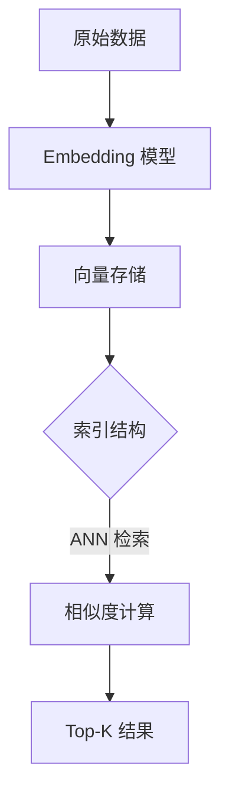

# 向量检索培训文档

## 第一部分：了解向量索引

向量检索的目标是将非结构化数据（文本、图像、音频等）映射到统一的向量空间，并基于距离或相似度完成语义检索。核心流程如下：

1. **向量化（Embedding）**：通过预训练或自训练模型，把原始对象转换为固定维度的向量。
2. **索引构建**：依据查询需求与数据规模，选择合适的数据结构组织向量，提升 ANN（Approximate Nearest Neighbor）检索效率。
3. **相似度计算**：查询向量与库内向量之间的距离度量，可选余弦相似度、内积、欧氏距离等。
4. **结果召回与排序**：在粗排召回的基础上，辅以精排或业务策略完成最终排序。



> **关键理解**：索引是加速检索的手段；向量质量、索引参数、监控体系、筛选策略共同决定最终效果。

---

## 第二部分：常见向量索引与 MatrixOne 状态

| 索引类型 | 核心参数 | 行为特征 | 适用场景 | 状态 |
| --- | --- | --- | --- | --- |
| IVF（倒排文件，MatrixOne 当前以 IVFFLAT 提供） | `nlist`（聚类中心数）、`nprobe`（查询时探测桶数）、`metric_type` | 向量聚类入桶，查询只扫描部分桶；构建较慢但查询高效 | 百万级以上向量库，延迟与精度需要折中 | 已支持 |
| HNSW | `M`（每节点连边数）、`efConstruction`（建索深度）、`efSearch`（查询拓展度） | 图结构；构建与查询均为分层搜索；支持增量插入 | 对召回要求高且延迟需控制的场景 | 已支持 |
| Flat | `metric_type` | 全表扫描；精确召回；参数少 | 数据量小或基准验证场景；高精度要求 | 规划中 |
| PQ / OPQ | `code_size`（码字长度）、`m`（子空间数）、`metric_type` | 对向量压缩；极大减少存储；精度略降 | 超大规模库、存储或内存紧张场景 | 规划中 |
| DiskANN / 混合存储 | `search_list_size`、`beam_width` | 内存+磁盘混合；需要异步维护数据页 | 10^8 级别以上向量、成本敏感 | 规划中 |

- **参数建议**（包含已支持与规划中索引的通用调参经验，供落地与评估参考）：
  - IVF：`nlist ≈ 4 * sqrt(N)`，`nprobe` 根据 SLA 调整。
  - HNSW：`M` 一般在 16~48；`efConstruction > efSearch`。
  - PQ：`code_size` 8~16 bit 常用；可配合 OPQ 降误差。

---

## 第三部分：召回调优指南

- **评估基准**：准备标注或弱标注样本，计算 precision@K、recall@K、nDCG 等指标。
- **参数调节策略**：
  - IVF：先固定 `nlist`，通过压力测试寻找最佳 `nprobe`；观察延迟与召回曲线。
    - 示例：SIFT128 数据集下，不同 `nlist`/`nprobe` 配置的召回表现（Recall@1）：

      | lists (`nlist`) | probe (`nprobe`) | Recall |
      | --- | --- | --- |
      | 2000 | 1 | 0.325 |
      | 2000 | 2 | 0.470 |
      | 2000 | 4 | 0.635 |
      | 2000 | 10 | 0.820 |
      | 2000 | 20 | 0.916 |
      | 2000 | 40 | 0.970 |
      | 2000 | 100 | *数据待补充* |
      | 4000 | 1 | 0.282 |
      | 4000 | 2 | 0.420 |
      | 4000 | 4 | 0.570 |
      | 4000 | 10 | 0.760 |
      | 4000 | 20 | 0.870 |
      | 4000 | 40 | 0.925 |
      | 4000 | 100 | 0.980 |
  - HNSW：通过增大 `efSearch` 获取召回上限，再根据延迟目标下调。
  - PQ/OPQ：调节 `code_size` 与 `m` 控制压缩率，与精排组合时可接受较大误差。
- **模型与特征质量**：向量需归一化；监控跨域数据偏移，周期性重新训练或微调。
- **精排策略**：粗排（IVF/HNSW/PQ）+ 精排（Flat/HNSW）或 rerank 模型，提升最终质量。
- **A/B 验证**：上线前进行离线评估与小流量实验，监控召回和业务指标变化。

---

## 第四部分：IVF 索引健康检查

- **桶负载（Bucket Load）**：
  - 统计每个聚类中心的向量数，关注最大/平均比值；
  - 若 >10 倍，考虑调高 `nlist` 或重建索引。
- **查询覆盖**：
  - 调整 `nprobe` 验证召回是否提升；
  - 若 `nprobe` 增大后召回仍低，需重新聚类或换索引类型。
- **延迟与资源**：
  - 监控 P95/P99 延迟、QPS、CPU/内存使用；
  - 对热点桶可二次聚类或做冷热分离。
- **重建策略**：
  - 数据分布漂移、召回不稳定时，触发全量或增量重建；
  - 建议结合后台任务与双写策略保障可用性。
- **仪表盘与告警**：
  - 关注 bucket load、构建耗时、滞留任务数、错误率；
  - 设置阈值告警，及时捕捉异常。

---

## 第五部分：混合过滤检索的 Story 与能力

- **典型故事**：
  1. 用户查询“红色连衣裙”，需同时关注颜色、价格、库存等属性。
  2. 流程：先用结构化过滤缩小候选范围，再执行向量召回，并融合业务排序。
- **当前能力**：
  - 支持布尔过滤（标签、时间、地区等）与向量检索组合；
  - 支持“关键词倒排 + 向量召回”的双通路策略；
  - SQL/DSL 层提供 Filter + Vector Search 组合算子。
- **业界常见策略**（参考 [Vector Requirements](https://raw.githubusercontent.com/XuPeng-SH/tae_design/for_demo/vector_requirements.md)）：
  - *Pre-filter*：先用结构化过滤缩小候选范围，再做向量检索。优点是所有返回结果天然满足约束、准确性高；缺点是过滤后的候选集合如果很大，ANN 索引效率会下降，甚至退化为暴力扫描，延迟显著上升。
  - *Post-filter*：先在全量上做向量检索得到较大的 Top-N，再套用过滤规则。优点是可以充分发挥索引性能、快速拿到候选；缺点是若 Top-N 中符合条件的结果很少，可能出现结果不足，需要放大候选集或补拉，整体资源与延迟压力较大。
  - MatrixOne 当前采用 *post-filter* 路径，并通过增大 Top-N / 多轮补拉等手段来弥补过滤后的结果缺口；后续会结合场景评估 pre-filter 能力，以兼顾性能与准确性。
- **实践经验**：
  - 控制候选数量：先过滤再 vector，可显著降低延迟；
  - 对融合策略提供可配置权重，支持线性加权或学习排序；
  - 建议建立混合检索的离线评估脚本，验证过滤命中率与召回质量。

---

## 第六部分：SDK 介绍

- **官方入口**：`clients/python/README.md`、`README_USER.md`、`docs/vector_guide.rst` 提供了完整功能说明、向量检索指南和 API 参考。
- **安装方式**：
  - 稳定版：`pip install matrixone-python-sdk`
  - 预发布版：`pip install --index-url https://test.pypi.org/simple/ --extra-index-url https://pypi.org/simple/ matrixone-python-sdk`
  - 开发环境：在 `clients/python` 目录执行 `make dev-setup` 或 `pip install -e '.[dev]'`
- **核心特性**：
  - `Client` 同时支持同步/异步接口、SQLAlchemy 生态集成、事务上下文。
  - `vector_ops` 管理向量索引（创建 IVF/HNSW、修改参数、删除索引）并提供检索能力。
  - `vector_ops.get_ivf_stats()` 针对 IVF 提供中心负载、距离分布等健康指标。
  - `mo_diag.py` CLI 与 SDK 一致，便于巡检与脚本化运维。

### 快速连接

```python
from matrixone import Client

client = Client()
client.connect(
    host='localhost',
    port=6001,
    user='root',
    password='111',
    database='test'
)
```

### 向量检索工作流示例（摘自 SDK README）

```python
import numpy as np
from matrixone import Client
from matrixone.orm import declarative_base
from matrixone.sqlalchemy_ext import create_vector_column
from sqlalchemy import Column, BigInteger, String, Text

Base = declarative_base()

class Document(Base):
    __tablename__ = 'documents'
    id = Column(BigInteger, primary_key=True, autoincrement=True)
    title = Column(String(200))
    content = Column(Text)
    embedding = create_vector_column(384, precision='f32')

client = Client()
client.connect(database='test')
client.create_table(Document)

# 创建 HNSW 索引（IVF 接口一致，使用 create_ivf）
client.vector_ops.enable_hnsw()
client.vector_ops.create_hnsw(
    'documents',
    name='idx_embedding',
    column='embedding',
    m=16,
    ef_construction=200
)

query_vector = np.random.rand(384).tolist()
results = client.vector_ops.similarity_search(
    'documents',
    vector_column='embedding',
    query_vector=query_vector,
    limit=5,
    distance_type='cosine'
)
```

### IVF 健康监控

```python
stats = client.vector_ops.get_ivf_stats('documents', 'embedding')
counts = stats['distribution']['centroid_count']
balance_ratio = max(counts) / min(counts) if min(counts) > 0 else float('inf')

if balance_ratio > 2.5:
    print("⚠️  IVF 索引需要重建或调参")
```

### 更多资源

- `clients/python/examples/`：涵盖向量检索、IVF 巡检、混合检索等脚本。
- `clients/python/docs/vector_guide.rst`：详细的向量索引使用手册与最佳实践。
- `mo_diag.py`：命令行工具，支持 `vector index list`、`vector index stats` 等巡检命令。

---

## 第七部分：正在推进的规划

- **混合检索增强**：完善关键词与向量的联合 rerank、支持更多字段过滤与策略配置。
- **异步索引管线**：提供后台构建/重建队列，解耦在线写路径，支持断点续建。
- **增量重建与原子切换**：按批次重建索引，支持无缝切换，缩短可用性窗口。
- **向量冷热分层**：探索热数据内存驻留、冷数据下发磁盘，降低成本。
- **自动调参服务**：基于线上反馈自动调节 `nprobe`、`efSearch`、`code_size` 等参数。
- **质量与监控体系**：沉淀统一仪表盘与告警策略，对召回、延迟、索引状态和数据漂移持续评估。
- **SDK 加强**：补充更多语言绑定、操作审计、向量 ETL 工具链。

---