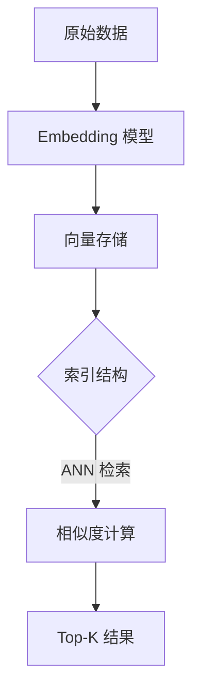

# MatrixOne 向量检索用户指南

## 目录

- [快速开始](#快速开始)
- [基础概念](#基础概念)
  - [向量检索概述](#向量检索概述)
  - [支持的索引类型](#支持的索引类型)
- [使用指南](#使用指南)
  - [创建向量索引](#创建向量索引)
  - [向量检索查询](#向量检索查询)
  - [混合过滤检索](#混合过滤检索)
- [性能优化](#性能优化)
  - [索引参数调优](#索引参数调优)
  - [内存缓存优化](#内存缓存优化)
  - [使用 Prefetch 减少冷启动](#使用-prefetch-减少冷启动)
- [问题排查](#问题排查)
  - [使用 EXPLAIN ANALYZE 分析查询](#使用-explain-analyze-分析查询)
  - [常见问题与解决方案](#常见问题与解决方案)
- [最佳实践](#最佳实践)
- [SDK 使用](#sdk-使用)
- [未来规划](#未来规划)

---

## 快速开始

### 创建表和索引

> **⚠️ 关键提示**：**必须先插入数据，再创建 IVF 索引**！这是获得最佳性能的关键步骤。详见下方说明。

```sql
-- 1. 创建包含向量列的表
CREATE TABLE documents (
  id VARCHAR(64) NOT NULL,
  content TEXT,
  embedding VECF32(384) COMMENT '384-dim embedding vector',
  category VARCHAR(50),
  created_at TIMESTAMP DEFAULT CURRENT_TIMESTAMP,
  PRIMARY KEY (id)
);

-- 2. ⚠️ 重要：先插入数据（至少 1000+ 条向量数据）
INSERT INTO documents (id, content, embedding, category) VALUES
  ('doc1', '人工智能简介', '[0.1,0.2,0.3,...]', '科技'),
  ('doc2', '数据库原理', '[0.4,0.5,0.6,...]', '技术');
-- ... 插入更多数据（建议至少 1000+ 条）

-- 3. ✅ 然后创建 IVF 向量索引（在数据插入之后）
CREATE INDEX idx_embedding USING ivfflat ON documents (embedding) 
  LISTS = 16 OP_TYPE 'vector_cosine_ops';

-- 4. 索引创建后，可以继续插入新数据（IVF 支持动态更新）
INSERT INTO documents (id, content, embedding, category) VALUES
  ('doc3', '新文档', '[0.7,0.8,0.9,...]', '科技');
```

### 执行向量检索

```sql
-- 基础向量检索
SELECT id, content 
FROM documents 
ORDER BY cosine_distance(embedding, '[0.12,0.55,0.33,...]') 
LIMIT 10 by rank;

-- 带过滤条件的混合检索
SELECT id, content, category 
FROM documents 
WHERE category = '科技' AND embedding IS NOT NULL
ORDER BY cosine_distance(embedding, '[0.12,0.55,0.33,...]') 
LIMIT 10 by rank 
with option 'mode=pre';
```

---

## 基础概念

### 向量检索概述

向量检索的目标是将非结构化数据（文本、图像、音频等）映射到统一的向量空间，并基于距离或相似度完成语义检索。核心流程如下：

1. **向量化（Embedding）**：通过预训练或自训练模型，把原始对象转换为固定维度的向量。
2. **索引构建**：依据查询需求与数据规模，选择合适的数据结构组织向量，提升 ANN（Approximate Nearest Neighbor）检索效率。
3. **相似度计算**：查询向量与库内向量之间的距离度量，可选余弦相似度、内积、欧氏距离等。
4. **结果召回与排序**：在粗排召回的基础上，辅以精排或业务策略完成最终排序。



> **关键理解**：索引是加速检索的手段；向量质量、索引参数、监控体系、筛选策略共同决定最终效果。

### 支持的索引类型

| 索引类型 | 核心参数 | 行为特征 | 适用场景 | 状态 |
| --- | --- | --- | --- | --- |
| **IVF（IVFFLAT）** | `nlist`（聚类中心数）、`nprobe`（查询时探测桶数）、`metric_type` | 向量聚类入桶，查询只扫描部分桶；构建较慢但查询高效 | 百万级以上向量库，延迟与精度需要折中 | ✅ 已支持 |
| **HNSW** | `M`（每节点连边数）、`efConstruction`（建索深度）、`efSearch`（查询拓展度） | 图结构；构建与查询均为分层搜索；支持增量插入 | 对召回要求高且延迟需控制的场景 | ✅ 已支持 |
| **Flat** | `metric_type` | 全表扫描；精确召回；参数少 | 数据量小或基准验证场景；高精度要求 | 🚧 规划中 |
| **PQ / OPQ** | `code_size`（码字长度）、`m`（子空间数）、`metric_type` | 对向量压缩；极大减少存储；精度略降 | 超大规模库、存储或内存紧张场景 | 🚧 规划中 |
| **DiskANN** | `search_list_size`、`beam_width` | 内存+磁盘混合；需要异步维护数据页 | 10^8 级别以上向量、成本敏感 | 🚧 规划中 |

**参数建议**：
- **IVF**：`nlist ≈ 4 * sqrt(N)`，`nprobe` 根据 SLA 调整
- **HNSW**：`M` 一般在 16~48；`efConstruction > efSearch`
- **PQ**：`code_size` 8~16 bit 常用；可配合 OPQ 降误差

---

## 使用指南

### 创建向量索引

#### IVF 索引

> **⚠️ 关键最佳实践：索引创建时机**

**必须先插入数据，再创建 IVF 索引！** 这是获得最佳性能和索引健康的关键步骤。

**为什么重要？**

IVF 索引在创建时会使用现有数据来确定聚类中心（centroids）的位置。如果在空表或数据很少的表上创建索引：
- 聚类中心位置可能不理想
- 后续数据分布可能不均匀
- 即使后续有大量数据，性能也会受到影响
- 可能导致桶负载不均衡，需要重建索引

**正确的创建流程**：

```sql
-- ✅ 正确顺序：先插入数据，再创建索引

-- 1. 创建表
CREATE TABLE documents (
  id VARCHAR(64) NOT NULL,
  content TEXT,
  embedding VECF32(384),
  PRIMARY KEY (id)
);

-- 2. 先插入初始数据（建议至少 1000+ 条向量）
INSERT INTO documents (id, content, embedding) VALUES
  ('doc1', '内容1', '[0.1,0.2,0.3,...]'),
  ('doc2', '内容2', '[0.4,0.5,0.6,...]');
-- ... 继续插入更多数据

-- 3. 根据实际数据量计算最优 LISTS 值
-- LISTS ≈ sqrt(向量数量) 到 4 * sqrt(向量数量)
-- 例如：10000 条向量，LISTS 建议为 100-400

-- 4. 创建 IVF 索引（在数据插入之后）
CREATE INDEX idx_embedding USING ivfflat ON documents (embedding) 
  LISTS = 100 OP_TYPE 'vector_cosine_ops';

-- 5. 索引创建后，可以继续插入新数据（IVF 支持动态更新）
INSERT INTO documents (id, content, embedding) VALUES
  ('doc3', '新内容', '[0.7,0.8,0.9,...]');
```

**错误的创建流程（避免）**：

```sql
-- ❌ 错误：在空表上创建索引
CREATE TABLE documents (...);
CREATE INDEX idx_embedding USING ivfflat ON documents (embedding) LISTS = 16;
INSERT INTO documents VALUES (...);  -- 数据分布可能不均匀
```

**基本语法**：

```sql
-- 基本语法
CREATE INDEX index_name USING ivfflat ON table_name (vector_column) 
  LISTS = <nlist> OP_TYPE '<metric_type>';

-- 示例：使用 L2 距离
-- 注意：确保表中已有足够数据（建议 1000+ 条）
CREATE INDEX idx_vec_l2 USING ivfflat ON documents (embedding) 
  LISTS = 16 OP_TYPE 'vector_l2_ops';

-- 示例：使用余弦相似度
CREATE INDEX idx_vec_cosine USING ivfflat ON documents (embedding) 
  LISTS = 32 OP_TYPE 'vector_cosine_ops';

-- 示例：使用内积
CREATE INDEX idx_vec_ip USING ivfflat ON documents (embedding) 
  LISTS = 16 OP_TYPE 'vector_ip_ops';
```

**参数说明**：
- `LISTS`：聚类中心数（`nlist`），建议值为 `sqrt(向量数量)` 到 `4 * sqrt(向量数量)`
  - 例如：10,000 条向量，建议 LISTS = 100-400
  - 例如：100,000 条向量，建议 LISTS = 316-1265
- `OP_TYPE`：距离函数类型
  - `vector_l2_ops`：L2 距离（欧氏距离）
  - `vector_cosine_ops`：余弦距离
  - `vector_ip_ops`：内积

**如果索引创建过早怎么办？**

如果已经在空表或数据很少的表上创建了索引，建议重建：

```sql
-- 1. 检查索引健康状态（见"问题排查"章节）
-- 如果 balance_ratio > 2.5，需要重建

-- 2. 删除旧索引
DROP INDEX idx_embedding ON documents;

-- 3. 确保表中已有足够数据（至少 1000+ 条）

-- 4. 根据实际数据量计算最优 LISTS
-- SELECT COUNT(*) FROM documents;  -- 假设得到 10000

-- 5. 重建索引
CREATE INDEX idx_embedding USING ivfflat ON documents (embedding) 
  LISTS = 100 OP_TYPE 'vector_cosine_ops';  -- 使用计算出的最优值
```

#### HNSW 索引

> **⚠️ 重要提示**：HNSW 索引目前处于 **Experimental（实验性）** 阶段，不建议在生产环境中使用。建议使用 IVF 索引，它已经过充分测试和优化，性能稳定可靠。

```sql
-- HNSW 索引创建（通过 SDK）
-- 详见 SDK 使用章节
-- 注意：HNSW 目前为实验性功能，不建议在生产环境使用
```

### 向量检索查询

#### 距离函数

MatrixOne 支持以下距离函数：

- `l2_distance(vector_col, query_vector)`：L2 距离（欧氏距离），值越小越相似
- `cosine_distance(vector_col, query_vector)`：余弦距离，值越小越相似
- `inner_product(vector_col, query_vector)`：内积，值越大越相似

**注意**：查询时使用的距离函数必须与索引的 `OP_TYPE` 匹配。

**距离函数与 OP_TYPE 对应关系**：

| 距离函数 | OP_TYPE | 说明 |
| --- | --- | --- |
| `l2_distance` | `vector_l2_ops` | L2 距离（欧氏距离） |
| `cosine_distance` | `vector_cosine_ops` | 余弦距离 |
| `inner_product` | `vector_ip_ops` | 内积 |

#### 基本查询语法

```sql
SELECT <列列表>
FROM <表名>
ORDER BY <距离函数>(<向量列>, '<查询向量>') [ASC|DESC]
LIMIT <数量> by rank;
```

**示例**：

```sql
-- 使用 L2 距离检索
SELECT id, content 
FROM documents 
ORDER BY l2_distance(embedding, '[0.1,0.2,0.3,0.4,...]') ASC 
LIMIT 10 by rank;

-- 使用余弦距离检索（DESC 表示相似度从高到低）
SELECT id, content 
FROM documents 
ORDER BY cosine_distance(embedding, '[0.1,0.2,0.3,0.4,...]') DESC 
LIMIT 10 by rank;
```

### 混合过滤检索

混合过滤检索结合结构化过滤（WHERE 条件）和向量检索，是实际应用中最常用的场景。

#### 检索模式

MatrixOne 支持三种检索模式：

| 模式 | 说明 | 优点 | 缺点 | 适用场景 |
| --- | --- | --- | --- | --- |
| **Pre-filter** | 先过滤后检索 | 所有返回结果都满足过滤条件，准确性高 | 过滤后候选集很大时，索引效率下降 | 过滤条件选择性高（过滤后 < 10% 数据） |
| **Post-filter** | 先检索后过滤 | 充分发挥索引性能，快速拿到候选 | 可能出现结果不足，需要 over-fetch | 大多数场景的默认选择 |
| **Force** | 禁用索引 | 精确结果 | 性能最差 | 数据量小或调试场景 |

#### SQL 语法

```sql
SELECT <列列表>
FROM <表名>
WHERE <过滤条件>
ORDER BY <距离函数>(<向量列>, '<查询向量>') [ASC|DESC]
LIMIT <数量> by rank
WITH OPTION 'mode=<模式>'[, 'nprobe=<值>'];  -- mode=pre, mode=post, mode=force
```

**选项说明**：
- `mode`：检索模式（`pre`、`post`、`force`）
- `nprobe`：查询时探测的桶数量（仅对 IVF 索引有效，可选，默认值为全局 `probe_limit` 设置或 5）

**模式选择建议**：

- **`mode=pre`**：适用于过滤条件选择性高的场景
  - 过滤后候选集 < 总数据量的 10%
  - 能保证所有返回结果都满足过滤条件
  - 示例：按特定类别、状态、时间范围等过滤
  - **注意**：当前 Python SDK 版本暂不支持 `mode=pre`，如需使用请直接使用 SQL 语句

- **`mode=post`**：适用范围较广（默认模式）
  - 过滤条件选择性低或中等
  - 需要充分利用向量索引性能
  - 需要较高召回率（可通过设置较大的 LIMIT 值）
  - 系统会自动进行 over-fetch 来弥补过滤后的结果缺口
  - **SDK 支持**：Python SDK 的 `similarity_search` 和 Pinecone 兼容接口默认使用 `mode=post`

- **`mode=force`**：适用于数据量小、需要精确结果或调试场景
  - 不使用向量索引，直接全表扫描

#### 使用示例

```sql
-- 创建表和索引
CREATE TABLE mini_embed_data (
  id VARCHAR(64) NOT NULL, 
  embedding VECF32(8) DEFAULT NULL, 
  content TEXT DEFAULT NULL, 
  description VARCHAR(255) DEFAULT NULL, 
  file_id VARCHAR(64) DEFAULT NULL, 
  score FLOAT DEFAULT NULL, 
  disabled TINYINT DEFAULT 0, 
  created_at TIMESTAMP DEFAULT CURRENT_TIMESTAMP, 
  PRIMARY KEY (id), 
  KEY idx_file_id (file_id)
);
CREATE INDEX idx_vec_embedding USING ivfflat ON mini_embed_data (embedding) 
  LISTS = 16 OP_TYPE 'vector_cosine_ops';

-- Pre-filter 模式：先过滤 file_id 和 disabled 状态，再进行向量检索
SELECT id, content, description, file_id, disabled 
FROM mini_embed_data 
WHERE file_id IN ('file01','file02') 
  AND embedding IS NOT NULL 
  AND (disabled IS NULL OR disabled = false) 
ORDER BY cosine_distance(embedding, "[0.12,0.55,0.33,0.88,0.22,0.44,0.66,0.11]") DESC 
LIMIT 10 by rank 
WITH OPTION 'mode=pre';

-- Pre-filter 模式 + 自定义 nprobe
SELECT id, content, description, file_id, disabled 
FROM mini_embed_data 
WHERE file_id IN ('file01','file02') 
  AND embedding IS NOT NULL 
  AND (disabled IS NULL OR disabled = false) 
ORDER BY cosine_distance(embedding, "[0.12,0.55,0.33,0.88,0.22,0.44,0.66,0.11]") DESC 
LIMIT 10 by rank 
WITH OPTION 'mode=pre', 'nprobe=20';

-- Post-filter 模式：先向量检索，再过滤（默认行为）
SELECT id, content, description, file_id, disabled 
FROM mini_embed_data 
WHERE file_id IN ('file01','file02') 
  AND embedding IS NOT NULL 
  AND (disabled IS NULL OR disabled = false) 
ORDER BY cosine_distance(embedding, "[0.12,0.55,0.33,0.88,0.22,0.44,0.66,0.11]") DESC 
LIMIT 10 by rank 
WITH OPTION 'mode=post';

-- 不指定模式时，默认使用 post-filter
WITH q AS (
  SELECT id, text, l2_distance(vec, '[0.1,-0.2,0.3,0.4,-0.1,0.2,0.0,0.5]') AS dist 
  FROM mini_vector_data 
  WHERE id LIKE 'id%'
) 
SELECT * FROM q 
ORDER BY dist 
LIMIT 3;
```

#### Over-fetch 机制（Post-filter 模式）

当使用 `mode=post` 且有过滤条件时，系统会根据 LIMIT 大小自动调整 over-fetch 倍数，以确保过滤后有足够的结果：

| LIMIT 范围 | Over-fetch 倍数 |
| --- | --- |
| < 10 | 5 倍 |
| 10-50 | 2 倍 |
| 50-100 | 1.5 倍 |
| 100-200 | 1.3 倍 |
| ≥ 200 | 1.2 倍 |

该机制在保证召回率的同时，尽可能减少不必要的向量检索开销。

#### 性能优化

**BloomFilter 优化**：
- 系统针对 IVF 索引表进行了 BloomFilter 过滤优化
- 通过减少数据解包和处理开销，显著提升了有过滤条件的向量检索查询性能
- 该优化对用户完全透明，无需额外配置即可享受性能提升

**查询计划优化**：
- 系统确保向量索引查询总是优先执行，而不是先扫描主表
- 支持在 `EXPLAIN` 命令中展示向量检索内部执行的查询计划
- 帮助用户更好地理解向量检索的执行过程，进行性能分析和优化

---

## 性能优化

### 索引参数调优

#### IVF 参数调优

**`nlist`（聚类中心数）**：
- 建议值：`nlist ≈ 4 * sqrt(N)`，其中 N 是向量数量
- 过小：桶内向量过多，查询时需要扫描更多数据
- 过大：索引构建时间增加，内存占用增加

**`nprobe`（查询时探测桶数）**：
- 控制查询时扫描的桶数量
- 越大：召回率越高，但查询延迟增加
- 越小：查询越快，但召回率可能下降
- **默认值**：5
- **设置方式**：
  - **全局设置**：`SET probe_limit = <值>;`（影响后续所有查询）
  - **查询级设置**：在查询中使用 `WITH OPTION 'nprobe=<值>'`（仅影响当前查询）
- 建议：根据 SLA 要求，通过压力测试寻找最佳值

**设置示例**：

```sql
-- 方式 1：全局设置（影响后续所有查询）
SET probe_limit = 10;

-- 方式 2：查询级设置（仅影响当前查询）
SELECT id, content 
FROM documents 
ORDER BY cosine_distance(embedding, '[0.1,0.2,...]') 
LIMIT 10 by rank 
WITH OPTION 'nprobe=20';

-- 方式 3：结合 mode 使用
SELECT id, content 
FROM documents 
WHERE category = '科技'
ORDER BY cosine_distance(embedding, '[0.1,0.2,...]') 
LIMIT 10 by rank 
WITH OPTION 'mode=pre', 'nprobe=15';
```

**召回率参考**（SIFT128 数据集，Recall@1）：

| lists (`nlist`) | probe (`nprobe`) | Recall |
| --- | --- | --- |
| 2000 | 1 | 0.325 |
| 2000 | 2 | 0.470 |
| 2000 | 4 | 0.635 |
| 2000 | 10 | 0.820 |
| 2000 | 20 | 0.916 |
| 2000 | 40 | 0.970 |
| 4000 | 10 | 0.760 |
| 4000 | 20 | 0.870 |
| 4000 | 40 | 0.925 |
| 4000 | 100 | 0.980 |

#### HNSW 参数调优

- **`M`**：每节点连边数，一般在 16~48
- **`efConstruction`**：建索深度，应大于 `efSearch`
- **`efSearch`**：查询拓展度，通过增大该值获取召回上限，再根据延迟目标下调

### 内存缓存优化

#### 为什么内存缓存至关重要

- **性能差异巨大**：从内存读取数据比从磁盘读取快 100-1000 倍，比从 S3 读取快 1000-10000 倍
- **向量索引特点**：向量索引通常包含大量数据（entries 表、centroids 表等），如果无法完全缓存，每次查询都需要进行磁盘 I/O 或 S3 访问
- **查询延迟影响**：频繁的磁盘 I/O 会导致查询延迟显著增加，影响用户体验

#### 容量规划

**单表场景**：
- 估算向量索引的总大小（包括 entries 表、centroids 表、metadata 表）
- 确保可用内存至少是索引大小的 1.5-2 倍，以支持缓存和查询操作
- 对于大型索引，考虑使用 `nlist` 参数控制索引大小

**多表场景**：
- 计算所有表的向量索引总大小
- 评估并发查询时可能同时加载的索引数量
- 预留足够的内存缓冲区，避免频繁的磁盘 I/O
- 考虑使用索引的冷热分离策略，将不常用的索引卸载

**内存估算公式**：
```
索引大小 ≈ (向量维度 × 4字节 × 向量数量) + (nlist × 向量维度 × 4字节) + 元数据开销
```

#### 如何判断内存缓存是否充足

使用 `EXPLAIN ANALYZE` 查看 `ReadSize` 中的 `disk` 值：
- 如果 `disk` 值经常不为 0，说明内存缓存不足
- 如果 `disk` 值每次都比较大，强烈建议增加内存容量
- 理想情况下，热数据查询时 `disk` 和 `s3` 应该为 0

**监控建议**：
- 定期检查系统内存使用情况
- 监控向量索引的缓存命中率
- 如果内存不足，考虑：
  - 减少 `nlist` 参数（会降低召回率，需要权衡）
  - 使用索引分区或分表策略
  - 升级硬件增加内存容量

### 使用 Prefetch 减少冷启动

#### 功能说明

Prefetch 功能可以将向量索引数据预先下载到 CN 节点的本地存储（local storage），从而减少第一次查询的冷启动时间。

**工作原理**：
- 当订阅表时，如果表名匹配配置的正则表达式模式，系统会自动将表的数据预取到本地存储
- 预取的数据存储在 CN 节点的本地磁盘缓存中，后续查询可以直接从本地读取，无需从 S3 下载
- 这可以显著减少第一次查询的延迟，特别是对于大型向量索引

#### 配置方式

**1. 配置文件方式**（推荐用于生产环境）：

在 `cn.toml` 配置文件中设置：

```toml
[cn.Engine]
# 只预取匹配的表
prefetch-on-subscribed = [
    '^my_database\.vector_table$',  # 精确匹配
    '^my_database\.vector_.*$',     # 匹配所有以 vector_ 开头的表
    '^.*\.embedding_table$',        # 匹配所有以 embedding_table 结尾的表
]
```

配置使用正则表达式匹配表名，格式为 `数据库名.表名`。

**2. 动态命令方式**（用于运行时调整）：

使用 `mo_ctl` 命令动态设置：

```sql
-- 设置单个表的预取规则
SELECT mo_ctl("cn", "prefetch-on-subscribed", "'^my_database\.vector_table$'");

-- 设置多个表的预取规则
SELECT mo_ctl("cn", "prefetch-on-subscribed", "'^my_database\.vector_.*$','^my_database\.embedding_.*$'");

-- 设置所有表的预取规则（谨慎使用，可能消耗大量存储空间）
SELECT mo_ctl("cn", "prefetch-on-subscribed", "'.*'");

-- 清除所有预取规则
SELECT mo_ctl("cn", "prefetch-on-subscribed", "'clean all'");
```

#### 使用建议

**适用场景**：
- 向量索引表较大，第一次查询需要从 S3 下载大量数据
- 需要保证查询性能稳定，避免冷启动延迟
- 有足够的本地存储空间

**注意事项**：
- Prefetch 会占用本地存储空间，需要确保 CN 节点有足够的磁盘空间
- 对于频繁更新的表，预取的数据可能会过期，需要定期刷新
- 不建议对所有表都启用预取，应该只针对重要的向量索引表

**最佳实践**：
- 优先在配置文件中设置，确保重启后配置仍然有效
- 使用精确的正则表达式，避免匹配到不需要的表
- 定期监控本地存储使用情况，避免磁盘空间不足
- 对于大型向量索引，考虑在系统空闲时手动触发预取

**验证 Prefetch 是否生效**：
- 使用 `EXPLAIN ANALYZE` 查看查询的 `ReadSize`
- 如果 Prefetch 生效，第一次查询的 `s3` 值应该较小或为 0
- 后续查询应该主要从本地磁盘读取（`disk` 值），而不是从 S3 读取

---

## 问题排查

### 使用 EXPLAIN ANALYZE 分析查询

`EXPLAIN ANALYZE` 命令可以实际执行查询并查看详细的执行统计信息，包括执行计划、资源消耗和执行时间等，帮助确认是否使用了向量索引以及查询的性能表现。

**注意**：`EXPLAIN ANALYZE` 会实际执行查询，而 `EXPLAIN` 只显示查询计划不执行查询。对于性能分析，建议使用 `EXPLAIN ANALYZE` 获取真实的执行统计信息。

#### 示例

```sql
-- 创建测试表和索引
CREATE TABLE test_vector_edge_cases (
  id bigint NOT NULL AUTO_INCREMENT,
  name varchar(100) DEFAULT NULL,
  score float DEFAULT NULL,
  embedding vecf32(16) DEFAULT NULL,
  PRIMARY KEY (id)
);
CREATE INDEX idx_embedding USING ivfflat ON test_vector_edge_cases(embedding) 
  LISTS 2 op_type 'vector_l2_ops';

-- 不带过滤条件的查询
EXPLAIN ANALYZE SELECT id, name, score FROM test_vector_edge_cases
ORDER BY l2_distance(embedding, '[0.863103449344635,0.6232981085777283,0.3308980166912079,0.06355834752321243,0.3109823167324066,0.32518333196640015,0.7296061515808105,0.6375574469566345,0.8872127532958984,0.472214937210083,0.11959424614906311,0.7132447957992554,0.7607850432395935,0.5612772107124329,0.7709671854972839,0.49379560351371765]')
LIMIT 3;
```

**执行计划输出示例**：

```
tp query plan
Project
  Analyze: timeConsumed=0ms waitTime=0ms inputRows=3 outputRows=3 (min=3, max=3) InputSize=144 bytes OutputSize=144 bytes ReadSize=0 bytes|0 bytes|0 bytes MemorySize=144 bytes (min=144 bytes, max=144 bytes)
  ->  Sort
        Analyze: timeConsumed=2ms waitTime=0ms inputRows=3 outputRows=3 (min=3, max=3) InputSize=144 bytes OutputSize=144 bytes ReadSize=0 bytes|0 bytes|0 bytes MemorySize=8.00 KiB (min=8.00 KiB, max=8.00 KiB)
        Sort Key: mo_ivf_alias_0.score INTERNAL
        Limit: 3
        ->  Join
              Analyze: timeConsumed=1ms waitTime=0ms inputRows=3 outputRows=3 (min=3, max=3) InputSize=176 bytes OutputSize=144 bytes ReadSize=0 bytes|0 bytes|0 bytes MemorySize=16 bytes (min=16 bytes, max=16 bytes)
              Join Type: INNER
              Join Cond: (test_vector_edge_cases.id = mo_ivf_alias_0.pkid)
              Runtime Filter Build: #[-1,0]
              ->  Table Scan on vector_index_edge_cases.test_vector_edge_cases
                    Analyze: timeConsumed=0ms waitTime=0ms inputBlocks=1 inputRows=3 outputRows=3 (min=3, max=3) InputSize=240 bytes OutputSize=160 bytes ReadSize=96.05 KiB|0 bytes|64.04 KiB MemorySize=409 bytes (min=409 bytes, max=409 bytes)
                    Runtime Filter Probe: test_vector_edge_cases.id
              ->  Table Function on ivf_search
                    Analyze: timeConsumed=1ms waitTime=0ms inputRows=0 outputRows=3 (min=3, max=3) InputSize=0 bytes OutputSize=48 bytes ReadSize=8.50 KiB|0 bytes|0 bytes MemorySize=8.50 KiB (min=8.50 KiB, max=8.50 KiB)
                    Index Reader Param:  Limit: 3
```

#### 关键统计信息说明

- **timeConsumed**：节点执行时间（毫秒），帮助识别性能瓶颈
- **waitTime**：等待时间（毫秒），表示节点等待其他资源的时间
- **inputRows/outputRows**：输入/输出行数，可以验证 over-fetch 机制
- **InputSize/OutputSize**：输入/输出数据大小，帮助了解数据传输量
- **ReadSize**：读取数据大小，格式为 `total|s3|disk`，分别表示总读取量、S3 读取量、磁盘读取量
- **MemorySize**：内存使用量
- **inputBlocks**（仅 Table Scan）：扫描的数据块数

**ReadSize 分析要点**：

1. **`ReadSize` 显示的是没有经过任何过滤的数据量**，即实际从存储层读取的原始数据大小
2. **如果 `ReadSize` 的 `total` 值比较大**，需要结合 SQL 查询评估是否合理：
   - 对于向量检索，如果 `ivf_search` 节点的 `ReadSize` 很大，可能是 `nprobe` 参数设置过大
   - 如果 `Table Scan` 节点的 `ReadSize` 很大，可能是过滤条件选择性不高
3. **Memory Cache 状态判断**：
   - 如果 `disk` 值（第三个值）**每次都比较大**，或者**每次都不是 0**，说明内存缓存不足
   - 理想情况下，热数据查询时 `disk` 和 `s3` 应该为 0
4. **第一次冷查询**：
   - 第一次查询向量索引时，数据可能存储在 S3 中，需要从 S3 下载全量数据
   - 此时 `s3` 值会比较大，查询延迟会显著增加
   - 这是正常现象，后续查询会使用本地缓存，性能会大幅提升

### 常见问题与解决方案

#### 1. 确认是否使用了向量索引

通过 `EXPLAIN ANALYZE` 输出可以判断：

- **使用了向量索引**：执行计划中会出现 `Table Function on ivf_search` 节点
- **未使用向量索引**：执行计划中只有 `Table Scan`，没有 `ivf_search` 节点

**常见原因**：
- 向量列上没有创建索引
- 查询中使用的距离函数与索引的 `op_type` 不匹配（例如索引是 `vector_l2_ops`，但查询使用了 `cosine_distance`）
- 使用了 `mode=force` 选项强制禁用索引

#### 2. 性能问题排查

如果查询性能不佳，使用 `EXPLAIN ANALYZE` 分析以下关键指标：

**Scan 数据流（inputRows/outputRows）**：
- 如果 `ivf_search` 节点的 `outputRows` 远大于 `LIMIT`，说明 over-fetch 较大
- 如果 `Table Scan` 的 `outputRows` 很大，说明过滤条件选择性不高

**Memory Size**：
- 如果内存使用过高，可能导致频繁的内存分配和释放
- 检查是否有多个向量索引同时加载

**ReadSize（total|s3|disk）**：
- 如果 `disk` 值经常不为 0，说明内存缓存不足
- 如果 `s3` 值较大，说明有 S3 访问，考虑使用 Prefetch 功能

**Duration（timeConsumed）**：
- 识别性能瓶颈节点，重点关注 `timeConsumed` 最长的节点
- 如果 `ivf_search` 节点耗时较长，考虑调整 `nprobe` 参数

**优化建议**：
- 如果 `ivf_search` 节点的扫描数据量很大，考虑调整 `nprobe` 参数
  - 使用 `SET probe_limit = <值>` 全局设置，或
  - 在查询中使用 `WITH OPTION 'nprobe=<值>'` 查询级设置
- 如果内存使用率高，检查是否有多个向量索引同时加载，考虑容量规划
- 如果磁盘 I/O 高（disk > 0），确保向量索引数据能够被内存缓存
- 如果 S3 访问频繁（s3 > 0），考虑使用 Prefetch 功能

#### 3. 避免在 SELECT 中返回向量列

**重要提示**：如无必要，不要在 `SELECT` 的投影列表中返回向量列。

向量列通常占用大量存储空间（例如 384 维的 `vecf32` 列需要约 1.5KB），返回向量列会：
- 显著增加网络传输开销
- 增加内存使用
- 降低查询响应速度

**推荐做法**：

```sql
-- ❌ 不推荐：返回向量列
SELECT id, name, embedding FROM documents 
ORDER BY cosine_distance(embedding, '[0.1,0.2,...]') 
LIMIT 10;

-- ✅ 推荐：只返回必要的列
SELECT id, name FROM documents 
ORDER BY cosine_distance(embedding, '[0.1,0.2,...]') 
LIMIT 10;
```

如果确实需要向量数据，可以考虑只返回向量 ID，然后根据 ID 单独查询向量。

#### 4. 向量精度选择

**强烈建议**：不要使用 `f64`（64 位浮点数）精度存储向量。

**原因**：
- **存储开销**：`f64` 需要 8 字节/维度，`f32` 只需要 4 字节/维度，存储空间是 `f32` 的 2 倍
- **内存占用**：更大的内存占用会影响缓存效率，可能导致更多的磁盘 I/O
- **性能影响**：更大的数据量会增加网络传输和计算开销
- **召回率**：在内部评估数据集上，`f32` 和 `f64` 的召回率差异通常可以忽略不计

**推荐做法**：

```sql
-- ❌ 不推荐：使用 f64
CREATE TABLE documents (
  id BIGINT PRIMARY KEY,
  embedding vecf64(384)  -- 占用更多空间
);

-- ✅ 推荐：使用 f32
CREATE TABLE documents (
  id BIGINT PRIMARY KEY,
  embedding vecf32(384)  -- 节省 50% 存储空间
);
```

#### 5. 索引创建时机问题

**问题表现**：
- 索引健康检查显示 balance_ratio > 2.5，即使数据量很大
- 查询性能不佳，即使索引已创建
- 桶负载严重不均衡

**可能原因**：
- **索引创建过早**：在空表或数据很少的表上创建了索引
- IVF 索引在创建时使用现有数据确定聚类中心位置
- 如果创建时数据太少，聚类中心位置不理想，导致后续数据分布不均匀

**解决方案**：

1. **检查索引健康状态**：
   ```python
   stats = client.vector_ops.get_ivf_stats('documents', 'embedding')
   counts = stats['distribution']['centroid_count']
   balance_ratio = max(counts) / min(counts) if min(counts) > 0 else float('inf')
   
   if balance_ratio > 2.5:
       print(f"⚠️ 索引可能创建过早！Balance ratio: {balance_ratio:.2f}")
   ```

2. **重建索引**（如果 balance_ratio > 2.5）：
   ```sql
   -- 1. 删除旧索引
   DROP INDEX idx_embedding ON documents;
   
   -- 2. 确认表中已有足够数据（至少 1000+ 条）
   SELECT COUNT(*) FROM documents;
   
   -- 3. 根据实际数据量计算最优 LISTS
   -- 例如：如果有 10000 条数据，LISTS = sqrt(10000) = 100
   
   -- 4. 重建索引
   CREATE INDEX idx_embedding USING ivfflat ON documents (embedding) 
     LISTS = 100 OP_TYPE 'vector_cosine_ops';
   ```

3. **使用 SDK 重建**：
   ```python
   # 检查当前数据量
   vector_count = get_vector_count('documents', 'embedding')
   
   # 计算最优 lists
   optimal_lists = int(np.sqrt(vector_count))
   
   # 删除旧索引
   client.vector_ops.drop('documents', 'idx_embedding')
   
   # 重建索引（此时表中已有足够数据）
   client.vector_ops.create_ivf(
       'documents',
       name='idx_embedding',
       column='embedding',
       lists=optimal_lists,
       op_type='vector_cosine_ops'
   )
   ```

**预防措施**：
- **始终**在插入足够数据（建议至少 1000+ 条）后再创建索引
- 根据实际数据量动态计算 `nlist` 参数，而不是使用固定值
- 创建索引后定期检查健康状态

#### 6. 检查桶的数据负载均衡

对于 IVF 索引，桶（bucket）的负载均衡情况直接影响查询性能和召回率。

**检查方法**：

使用 SDK 的 `get_ivf_stats()` 方法检查桶的负载分布：

```python
from matrixone import Client

client = Client()
client.connect(database='test')

# 获取 IVF 索引统计信息
stats = client.vector_ops.get_ivf_stats('documents', 'embedding')
counts = stats['distribution']['centroid_count']

# 计算负载均衡比率
max_count = max(counts)
min_count = min(counts) if min(counts) > 0 else 1
balance_ratio = max_count / min_count

print(f"最大桶向量数: {max_count}")
print(f"最小桶向量数: {min_count}")
print(f"负载均衡比率: {balance_ratio:.2f}")

# 判断是否需要重建索引
if balance_ratio > 10:
    print("⚠️  警告：桶负载不均衡，建议重建索引或调整 nlist 参数")
elif balance_ratio > 5:
    print("⚠️  注意：桶负载存在一定不均衡，建议监控")
else:
    print("✅ 桶负载均衡良好")
```

**优化建议**：
- **负载均衡比率 > 10**：强烈建议重建索引，增加 `nlist` 参数
- **负载均衡比率 5-10**：建议监控，如果性能下降则考虑重建
- **负载均衡比率 < 5**：通常可以接受，继续监控即可

**重建索引示例**：

```sql
-- 重建索引，增加 nlist 参数
ALTER TABLE documents ALTER REINDEX idx_embedding ivfflat lists=32;
```

**预防措施**：
- 在创建索引时，根据数据量合理设置 `nlist` 参数（建议 `nlist ≈ 4 * sqrt(N)`）
- 定期检查索引健康状态，特别是在数据大量更新后
- 如果数据分布发生变化，及时重建索引

---

## 最佳实践

### 索引创建

1. **⚠️ 关键：先插入数据，再创建索引**（最重要！）
   - **必须**在表中已有足够数据（建议至少 1000+ 条向量）后再创建 IVF 索引
   - 如果索引创建过早，会导致聚类中心位置不理想，数据分布不均匀
   - 即使后续有大量数据，性能也会受到影响
   - **正确流程**：创建表 → 插入数据（1000+ 条）→ 创建索引 → 继续插入新数据
   - **错误流程**：创建表 → 创建索引 → 插入数据（不推荐）

2. **合理设置 `nlist` 参数**：建议值为 `sqrt(向量数量)` 到 `4 * sqrt(向量数量)`
   - 根据实际数据量计算，而不是固定值
   - 例如：10,000 条向量，建议 `nlist = 100-400`
   - 例如：100,000 条向量，建议 `nlist = 316-1265`

3. **选择合适的距离函数**：根据应用场景选择 L2、余弦或内积

4. **使用 `f32` 精度**：除非特殊需求，否则使用 `f32` 而非 `f64`

### 查询优化

1. **模式选择**：
   - 过滤后候选集 < 总数据量的 10% 时，优先考虑 `mode=pre`
   - 其他大多数场景推荐使用 `mode=post`（默认）
   - 如果不确定，先用 `mode=post` 进行测试

2. **避免返回向量列**：如无必要，不要在 SELECT 中返回向量列

3. **在过滤列上建立常规索引**：可显著提升 pre-filter 模式的性能

### 性能优化

1. **容量规划**：
   - 确保可用内存至少是向量索引总大小的 1.5-2 倍
   - 在多表场景下，预留足够的内存缓冲区

2. **使用 Prefetch 功能**：对于大型向量索引，预先下载数据到本地存储

3. **监控与调优**：
   - 定期使用 `EXPLAIN ANALYZE` 分析查询性能
   - 监控内存使用情况和缓存命中率
   - 检查桶的负载均衡情况

### 召回率优化

1. **参数调节**：通过压力测试寻找最佳 `nprobe` 值
2. **模型质量**：确保向量已归一化，监控跨域数据偏移
3. **A/B 验证**：上线前进行离线评估与小流量实验

---

## SDK 使用

### 安装

```bash
# 稳定版
pip install -U matrixone-python-sdk

# 预发布版
pip install --index-url https://test.pypi.org/simple/ --extra-index-url https://pypi.org/simple/ matrixone-python-sdk

# 开发环境
cd clients/python
make dev-setup
# 或
pip install -e '.[dev]'
```

### 快速连接

```python
from matrixone import Client

client = Client()
client.connect(
    host='localhost',
    port=6001,
    user='root',
    password='111',
    database='test'
)
```

### 向量检索工作流

> **⚠️ 关键最佳实践**：**必须先插入数据，再创建 IVF 索引！** 这是获得最佳性能的关键步骤。

```python
import numpy as np
from matrixone import Client
from matrixone.orm import declarative_base
from matrixone.sqlalchemy_ext import create_vector_column
from sqlalchemy import Column, BigInteger, String, Text

Base = declarative_base()

class Document(Base):
    __tablename__ = 'documents'
    id = Column(BigInteger, primary_key=True, autoincrement=True)
    title = Column(String(200))
    content = Column(Text)
    embedding = create_vector_column(384, precision='f32')

client = Client()
client.connect(database='test')
client.create_table(Document)

# ⚠️ 关键步骤 1：先插入初始数据（建议至少 1000+ 条向量）
# 这是获得最佳索引性能的关键！
initial_documents = [
    {
        'id': i,
        'title': f'Document {i}',
        'content': f'Content for document {i}',
        'embedding': np.random.rand(384).tolist()
    }
    for i in range(1000)  # 至少插入 1000 条数据
]
client.batch_insert(Document, initial_documents)

# ⚠️ 关键步骤 2：根据实际数据量计算最优 lists 值
vector_count = len(initial_documents)
optimal_lists = int(np.sqrt(vector_count))  # 例如：√1000 ≈ 32
# 或者使用范围：optimal_lists = int(4 * np.sqrt(vector_count))  # 例如：4*√1000 ≈ 126

# ⚠️ 关键步骤 3：在数据插入之后创建 IVF 索引
client.vector_ops.enable_ivf()
client.vector_ops.create_ivf(
    'documents',
    name='idx_embedding',
    column='embedding',
    lists=optimal_lists,  # 使用计算出的最优值，而不是固定值
    op_type='vector_cosine_ops'
)

# ✅ 索引创建后，可以继续插入新数据（IVF 支持动态更新）
new_doc = {
    'id': 1001,
    'title': 'New Document',
    'content': 'New content',
    'embedding': np.random.rand(384).tolist()
}
client.insert(Document, new_doc)  # IVF 支持动态更新

# 向量检索
query_vector = np.random.rand(384).tolist()
results = client.vector_ops.similarity_search(
    'documents',
    vector_column='embedding',
    query_vector=query_vector,
    limit=5,
    distance_type='cosine'
)

# ❌ 错误示例：不要在空表上创建索引
# client.create_table(Document)
# client.vector_ops.create_ivf(...)  # ❌ 错误：表是空的
# client.batch_insert(Document, data)  # 数据分布可能不均匀
```

### IVF 健康监控

```python
stats = client.vector_ops.get_ivf_stats('documents', 'embedding')
counts = stats['distribution']['centroid_count']
balance_ratio = max(counts) / min(counts) if min(counts) > 0 else float('inf')

if balance_ratio > 2.5:
    print("⚠️  IVF 索引需要重建或调参")
```

### SDK 使用限制说明

**重要提示**：
- **Pre-filter 模式**：当前 Python SDK 版本暂不支持 `mode=pre`（Pre-filter 模式）。如需使用 Pre-filter 功能，请直接使用 SQL 语句执行查询。
- **HNSW 索引**：HNSW 索引目前处于实验性（Experimental）阶段，不建议在生产环境使用。建议使用 IVF 索引。

### Pinecone 兼容接口

MatrixOne 提供了 Pinecone 兼容接口，方便从 Pinecone 迁移到 MatrixOne。该接口支持 Pinecone 风格的 API，包括 `upsert`、`query` 等操作，以及丰富的过滤条件支持。

**注意**：Pinecone 兼容接口的 `query` 方法默认使用 `mode=post`（Post-filter 模式），暂不支持 `mode=pre`。如需使用 Pre-filter 模式，请直接使用 SQL 语句。

#### 基本使用

```python
from matrixone import Client

client = Client()
client.connect(host='localhost', port=6001, user='root', password='111', database='test')

# 方式 1：使用 client.get_pinecone_index() 获取索引（推荐）
index = client.get_pinecone_index('documents', 'embedding')

# 方式 2：直接使用 PineconeCompatibleIndex 类
from matrixone.search_vector_index import PineconeCompatibleIndex

index = PineconeCompatibleIndex(
    client=client,
    table_name='documents',
    vector_column='embedding',
    dimension=384
)
```

#### 插入数据（Upsert）

```python
# 插入或更新向量数据
index.upsert([
    {
        "id": "1",
        "values": [0.1, 0.2, 0.3] * 128,  # 384 维向量
        "metadata": {"title": "Document 1", "category": "tech"}
    },
    {
        "id": "2",
        "values": [0.4, 0.5, 0.6] * 128,
        "metadata": {"title": "Document 2", "category": "science"}
    }
])
```

#### 向量检索（Query）

```python
# 基础查询
results = index.query(
    vector=[0.1, 0.2, 0.3] * 128,
    top_k=5,
    include_metadata=True
)

# 遍历结果
for match in results.matches:
    print(f"ID: {match.id}, Score: {match.score}")
    print(f"Metadata: {match.metadata}")
```

#### 过滤条件查询

Pinecone 兼容接口支持丰富的过滤条件，包括各种操作符：

```python
# 等值过滤
results = index.query(
    vector=[0.1, 0.2, 0.3] * 128,
    top_k=10,
    filter={"category": "tech"}
)

# 比较操作符：$gt, $gte, $lt, $lte
results = index.query(
    vector=[0.1, 0.2, 0.3] * 128,
    top_k=10,
    filter={"rating": {"$gte": 8.0}}
)

# 包含操作符：$in, $nin
results = index.query(
    vector=[0.1, 0.2, 0.3] * 128,
    top_k=10,
    filter={"category": {"$in": ["tech", "science"]}}
)

# 逻辑操作符：$and, $or
results = index.query(
    vector=[0.1, 0.2, 0.3] * 128,
    top_k=10,
    filter={
        "$and": [
            {"category": "tech"},
            {"rating": {"$gte": 8.0}}
        ]
    }
)

# 复杂嵌套条件
results = index.query(
    vector=[0.1, 0.2, 0.3] * 128,
    top_k=10,
    filter={
        "$and": [
            {"category": {"$in": ["tech", "science"]}},
            {
                "$or": [
                    {"rating": {"$gte": 8.5}},
                    {"year": {"$gte": 2020}}
                ]
            }
        ]
    }
)
```

#### 支持的过滤操作符

| 操作符 | 说明 | 示例 |
| --- | --- | --- |
| `$eq` | 等于 | `{"status": "active"}` |
| `$ne` | 不等于 | `{"status": {"$ne": "deleted"}}` |
| `$gt` | 大于 | `{"rating": {"$gt": 8.0}}` |
| `$gte` | 大于等于 | `{"year": {"$gte": 2020}}` |
| `$lt` | 小于 | `{"price": {"$lt": 100}}` |
| `$lte` | 小于等于 | `{"age": {"$lte": 65}}` |
| `$in` | 在列表中 | `{"category": {"$in": ["tech", "science"]}}` |
| `$nin` | 不在列表中 | `{"status": {"$nin": ["deleted", "archived"]}}` |
| `$and` | 逻辑与 | `{"$and": [{"a": 1}, {"b": 2}]}` |
| `$or` | 逻辑或 | `{"$or": [{"a": 1}, {"b": 2}]}` |

#### 查询参数

```python
results = index.query(
    vector=[0.1, 0.2, 0.3] * 128,
    top_k=5,
    include_metadata=True,      # 是否包含元数据
    include_values=False,        # 是否包含向量值
    filter={"category": "tech"}, # 过滤条件
    namespace="default"          # 命名空间（可选）
)

# 访问结果
print(f"返回 {len(results.matches)} 条结果")
print(f"使用 {results.usage['read_units']} 个读取单位")
for match in results.matches:
    print(f"  ID: {match.id}, Score: {match.score}")
    if match.metadata:
        print(f"  Metadata: {match.metadata}")
    if match.values:
        print(f"  Vector: {match.values[:5]}...")  # 只显示前 5 维
```

#### 异步查询

```python
from matrixone import AsyncClient

async_client = AsyncClient()
await async_client.connect(host='localhost', port=6001, user='root', password='111', database='test')

index = async_client.get_pinecone_index('documents', 'embedding')

# 异步查询
results = await index.query_async(
    vector=[0.1, 0.2, 0.3] * 128,
    top_k=5,
    filter={"category": "tech"}
)
```

#### 完整示例

```python
from matrixone import Client
from matrixone.sqlalchemy_ext import create_vector_column
from sqlalchemy import Column, Integer, String, Float
from matrixone.orm import declarative_base
import numpy as np

Base = declarative_base()

class Movie(Base):
    __tablename__ = 'movies'
    id = Column(Integer, primary_key=True)
    title = Column(String(200))
    genre = Column(String(50))
    year = Column(Integer)
    rating = Column(Float)
    embedding = create_vector_column(64, 'f32')

# 创建客户端和表
client = Client()
client.connect(host='localhost', port=6001, user='root', password='111', database='test')
client.create_table(Movie)

# 创建向量索引
client.vector_ops.enable_ivf()
client.vector_ops.create_ivf('movies', name='idx_embedding', column='embedding', lists=16)

# 插入数据
movies_data = [
    {"id": 1, "title": "The Matrix", "genre": "action", "year": 1999, "rating": 8.7, "embedding": [0.1] * 64},
    {"id": 2, "title": "Inception", "genre": "sci-fi", "year": 2010, "rating": 8.8, "embedding": [0.2] * 64},
    {"id": 3, "title": "The Dark Knight", "genre": "action", "year": 2008, "rating": 9.0, "embedding": [0.3] * 64},
]
client.vector_ops.batch_insert('movies', movies_data)

# 使用 Pinecone 兼容接口查询
index = client.get_pinecone_index('movies', 'embedding')

# 查询动作片
results = index.query(
    vector=[0.15] * 64,
    top_k=10,
    filter={"genre": "action"},
    include_metadata=True
)

print(f"找到 {len(results.matches)} 部动作片：")
for match in results.matches:
    print(f"  {match.metadata['title']} ({match.metadata['year']}) - 评分: {match.metadata['rating']}")

# 查询高分科幻片
results = index.query(
    vector=[0.15] * 64,
    top_k=10,
    filter={
        "$and": [
            {"genre": "sci-fi"},
            {"rating": {"$gte": 8.5}}
        ]
    },
    include_metadata=True
)
```

#### 从 Pinecone 迁移

如果您之前使用 Pinecone，可以轻松迁移到 MatrixOne：

1. **保持相同的 API 风格**：MatrixOne 的 Pinecone 兼容接口与 Pinecone 的 API 高度一致
2. **无需修改业务代码**：只需更改连接方式，其他代码基本无需修改
3. **支持更多功能**：MatrixOne 还提供了 SQL 接口和更多高级功能

**迁移步骤**：

```python
# 原 Pinecone 代码
# import pinecone
# pinecone.init(api_key="your-api-key", environment="us-west1-gcp")
# index = pinecone.Index("your-index-name")

# MatrixOne 迁移后
from matrixone import Client
client = Client()
client.connect(host='your-matrixone-host', port=6001, user='root', password='your-password', database='your-db')
index = client.get_pinecone_index('your-table-name', 'your-vector-column')

# 后续的 upsert、query 等操作保持不变
```

### 更多资源

- `clients/python/examples/`：涵盖向量检索、IVF 巡检、混合检索等脚本
- `clients/python/docs/vector_guide.rst`：详细的向量索引使用手册与最佳实践
- `mo_diag.py`：命令行工具，支持 `vector index list`、`vector index stats` 等巡检命令

---

## 未来规划

- **混合检索增强**：完善关键词与向量的联合 rerank、支持更多字段过滤与策略配置
- **异步索引管线**：提供后台构建/重建队列，解耦在线写路径，支持断点续建
- **增量重建与原子切换**：按批次重建索引，支持无缝切换，缩短可用性窗口
- **向量冷热分层**：探索热数据内存驻留、冷数据下发磁盘，降低成本
- **自动调参服务**：基于线上反馈自动调节 `nprobe`、`efSearch`、`code_size` 等参数
- **质量与监控体系**：沉淀统一仪表盘与告警策略，对召回、延迟、索引状态和数据漂移持续评估
- **SDK 加强**：补充更多语言绑定、操作审计、向量 ETL 工具链
- **向量精度优化**：`bf16` 精度方案正在开发中，未来将在保证召回的前提下进一步降低存储成本

---

## 附录

### 召回率参考数据

SIFT128 数据集下，不同 `nlist`/`nprobe` 配置的召回表现（Recall@1）：

| lists (`nlist`) | probe (`nprobe`) | Recall |
| --- | --- | --- |
| 2000 | 1 | 0.325 |
| 2000 | 2 | 0.470 |
| 2000 | 4 | 0.635 |
| 2000 | 10 | 0.820 |
| 2000 | 20 | 0.916 |
| 2000 | 40 | 0.970 |
| 4000 | 1 | 0.282 |
| 4000 | 2 | 0.420 |
| 4000 | 4 | 0.570 |
| 4000 | 10 | 0.760 |
| 4000 | 20 | 0.870 |
| 4000 | 40 | 0.925 |
| 4000 | 100 | 0.980 |

### 相关资源

- **官方文档**：`clients/python/README.md`、`README_USER.md`、`docs/vector_guide.rst`
- **示例代码**：`clients/python/examples/`
- **命令行工具**：`mo_diag.py`

---

## 贡献指南

### 如何提交 Issue

如果您在使用过程中遇到问题或有功能建议，欢迎在 MatrixOne 的 GitHub 仓库提交 Issue：

1. **访问 MatrixOne GitHub 仓库**：
   - 仓库地址：https://github.com/matrixorigin/matrixone
   - 点击 "Issues" 标签页

2. **创建新 Issue**：
   - 点击 "New Issue" 按钮
   - 选择合适的 Issue 模板（Bug Report、Feature Request 等）

3. **填写 Issue 信息**：
   - **标题**：简洁明确地描述问题或建议
   - **描述**：详细说明问题现象、复现步骤、预期行为、实际行为
   - **环境信息**：MatrixOne 版本、操作系统、Python 版本（如适用）
   - **相关代码**：提供最小可复现的代码示例
   - **日志信息**：如有错误日志，请一并提供

4. **添加标签**：
   - 如果是向量检索相关问题，可以添加 `vector` 或 `vector-index` 标签
   - 如果是 SDK 相关问题，可以添加 `sdk` 或 `python-sdk` 标签

**Issue 示例**：

```markdown
## 问题描述
在使用向量检索时，遇到 XXX 问题...

## 复现步骤
1. 创建表和索引
2. 执行查询
3. 观察到错误

## 预期行为
应该返回 XXX 结果

## 实际行为
实际返回了 XXX 错误

## 环境信息
- MatrixOne 版本：v0.8.0
- Python SDK 版本：0.1.0
- 操作系统：Linux
- Python 版本：3.9

## 相关代码
```python
# 最小可复现代码
```

## 错误日志
```
错误信息...
```
```

### 如何提交 Pull Request

如果您想为 MatrixOne 贡献代码，欢迎提交 Pull Request：

1. **Fork 仓库**：
   - 访问 https://github.com/matrixorigin/matrixone
   - 点击右上角的 "Fork" 按钮，将仓库 Fork 到您的账户

2. **克隆您的 Fork**：
   ```bash
   git clone https://github.com/your-username/matrixone.git
   cd matrixone
   ```

3. **创建分支**：
   ```bash
   git checkout -b feature/your-feature-name
   # 或
   git checkout -b fix/your-bug-fix
   ```

4. **进行开发**：
   - 编写代码
   - 添加测试用例
   - 确保代码通过现有测试
   - 遵循项目的代码规范和风格

5. **提交更改**：
   ```bash
   git add .
   git commit -m "feat: 添加 XXX 功能"  # 或 "fix: 修复 XXX 问题"
   git push origin feature/your-feature-name
   ```

6. **创建 Pull Request**：
   - 访问您的 Fork 仓库页面
   - 点击 "Compare & pull request" 按钮
   - 填写 PR 描述：
     - **标题**：简洁描述您的更改
     - **描述**：详细说明更改内容、解决的问题、测试情况
     - **关联 Issue**：如果解决了某个 Issue，使用 `Fixes #123` 或 `Closes #123` 关联

7. **代码审查**：
   - 等待维护者审查
   - 根据反馈进行修改
   - 通过 CI/CD 检查

**PR 描述示例**：

```markdown
## 更改类型
- [ ] Bug 修复
- [x] 新功能
- [ ] 文档更新
- [ ] 性能优化

## 更改描述
添加了 XXX 功能，解决了 XXX 问题...

## 相关问题
Fixes #123

## 测试情况
- [x] 添加了单元测试
- [x] 通过了所有现有测试
- [x] 进行了手动测试

## 检查清单
- [x] 代码遵循项目规范
- [x] 添加了必要的文档
- [x] 更新了相关测试
- [x] 没有引入破坏性更改
```

### 贡献建议

- **向量检索相关**：如果您想贡献向量检索相关的功能或修复，建议先查看 `pkg/vectorindex/` 目录下的代码
- **SDK 相关**：如果您想贡献 Python SDK 相关的功能，建议查看 `clients/python/` 目录
- **文档相关**：文档改进同样欢迎，可以直接提交 PR 修改相关文档文件

### 获取帮助

- **GitHub Discussions**：https://github.com/matrixorigin/matrixone/discussions
- **MatrixOne 社区**：访问 MatrixOne 官网了解社区信息
- **文档**：查看项目 README 和文档获取更多信息

感谢您对 MatrixOne 的贡献！🎉
