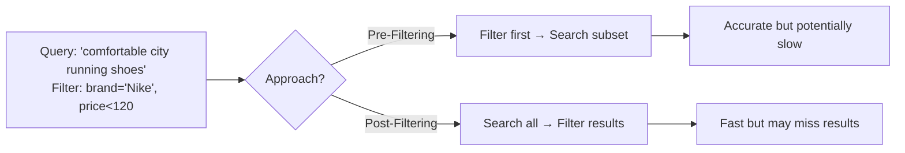
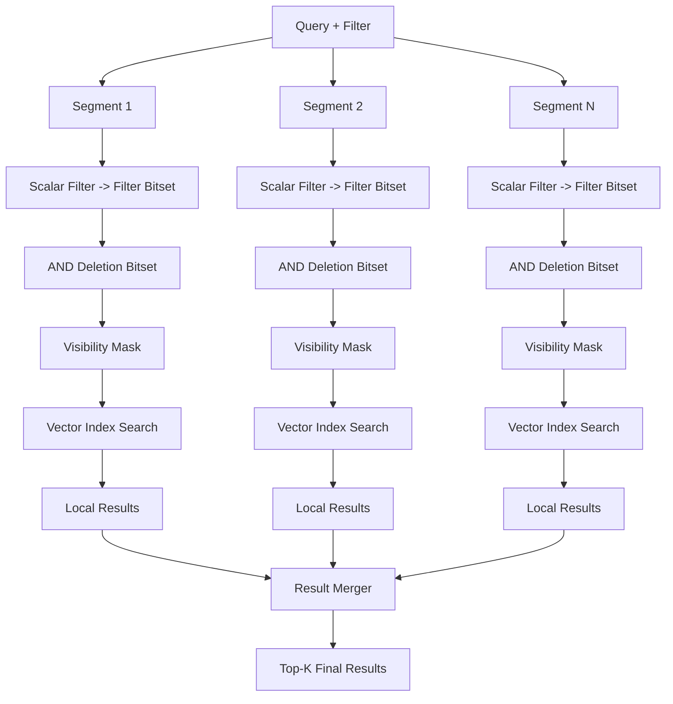

# Filtering in Vector Search: From Concept to Index Requirements

## A Real-World Analogy: Shopping for Shoes

Imagine an e-commerce platform that understands natural-language queries like *“comfortable running shoes for city walks”* using vector embeddings. While semantic similarity helps find relevant items, users also expect precise filtering by structured attributes—such as brand, price, or size.

To combine semantic relevance with hard constraints, systems typically use one of two strategies: **pre-filtering** or **post-filtering**.

---

### 1. Pre-Filtering
*“First, restrict to Nike shoes under $120. Then find the most similar to ‘comfortable for city walks.’”*

- **How it works**:
  Apply metadata filters first to narrow the candidate set, then run vector search only on the filtered subset.

- **Pros**:
  All results satisfy the filter—high precision and correctness.

- **Cons**:
  If the filtered subset is large, brute-force similarity search becomes slow. Approximate Nearest Neighbor (ANN) indexes lose efficiency because they are optimized for the full dataset.

> This is like asking a clerk to pull all Nike shoes under $120 from the warehouse before picking the comfiest ones—accurate, but potentially slow.

---

### 2. Post-Filtering
*“Find the most semantically relevant shoes first, then remove any that aren't Nike or cost more than $120.”*

- **How it works**:
  Run vector search over the entire catalog to get top-K results, then discard those that fail the filter.

- **Pros**:
  Fast initial search using a fully optimized ANN index.

- **Cons**:
  Risk of returning few or zero results if the top-K contains no matches—even if relevant items exist just outside the retrieval window.

> Like receiving 100 "comfortable-looking" shoes, only to reject 95 because they're the wrong brand or too expensive.

---

### Strategy Comparison

---

## How Milvus Implements Efficient Pre-Filtering

In production systems like **Milvus**, naive pre-filtering is avoided. Instead, filtering is **pushed down to each data segment**—the fundamental unit of storage and indexing.

Milvus stores data in multiple **segments**, each containing:
- Vector embeddings and an ANN index (e.g., IVF, HNSW)
- Scalar metadata (e.g., `brand`, `price`)
- A **deletion bitset** marking logically deleted records

During a hybrid query:
1. For each segment, Milvus evaluates the scalar filter → produces a **filter bitset**.
2. This bitset is **logically ANDed** with the segment's **deletion bitset** → yields a **visibility mask**.
3. The mask is passed to the vector index, which **skips excluded vectors** during traversal.
4. Local results from all segments are merged and re-ranked to produce the final top-K.

This design ensures:
- **Correctness**: no deleted or filtered-out items appear
- **Efficiency**: ANN index traversal remains fast
- **Scalability**: segments are processed in parallel

### Milvus Hybrid Search: End-to-End View

> This diagram uses only plain text nodes and standard Mermaid syntax, ensuring compatibility with most documentation and CI/CD pipelines.

---

## Core Requirement: What Vector Indexes Must Support

The Milvus approach reveals a fundamental requirement for **production-grade vector indexes**:

> **The index must accept a visibility mask (typically a bitset) as input to the search function.**

This capability enables:

| Use Case            | How Bitset Is Used |
|---------------------|--------------------|
| **Hybrid Queries**  | Mask out vectors that fail scalar filters |
| **Soft Deletions**  | Mask out logically deleted records |
| **Time-based TTL**  | Mask out expired entries |
| **Access Control**  | Mask out records not visible to the current user |

Without native bitset support, systems are forced to:
- Fall back to post-filtering (risking empty results)
- Rebuild indexes on every delete (costly)
- Scan entire segments (slow)

Thus, **bitset-aware search is not optional—it's essential** for building reliable, scalable vector search systems in real-world applications.

---

## Summary

- **Pre-filtering** guarantees correctness but requires efficient implementation.
- **Post-filtering** is fast but unreliable under restrictive filters.
- **Milvus** implements scalable pre-filtering by generating **per-segment bitsets** and merging them with deletion masks.
- This architecture demands that **vector indexes expose a bitset-based filtering interface**—a non-negotiable feature for modern vector databases handling hybrid queries, deletions, and data lifecycle management.
